# Chapitre I : Introduction à la vision par ordinateur

Ce chapitre introduit des notions essentielles pour ce cours telles que la capture, la numérisation, l'affichage et la retouche d'images.
Il amènera ainsi petit à petit le concept de "vision", et la discipline de la "vision par ordinateur" (ou "computer vision" en anglais).

_"J’ai la satisfaction de pouvoir t’annoncer enfin, qu’à l’aide du perfectionnement de mes procédés je suis parvenu à obtenir un point de vue tel que je pouvais le désirer, et que je n’osais guère pourtant m’en flatter, parce que jusqu’ici, je n’avais eu que des résultats forts incomplets.
Ce point de vue a été pris de ta chambre du côté du Gras; et je me suis servi à cet effet de ma plus grande chambre obscure et de ma plus grande pierre.
L’image des objets s’y trouve représentée avec une netteté, une fidélité étonnante, jusque dans ses moindres détails, et avec leurs nuances les plus délicates."_

**Nicéphore Niépce, lettre du 16 septembre 1824, à destination de son frère Claude.**

---

## Images exemples

Ce chapitre sera illustré par quelques images exemples.

Vous trouverez la première [ici](https://github.com/NicOudart/UVSQ_EN3901_computer_vision/blob/master/images/Ghost_crab.jpg).

Il s'agit d'une photographie d'un _Ocypode quadrata_, aussi connu sous le nom de "Atlantic Ghost Crab", prise en 2023 à Padre Island National Seashore (Texas, USA).

Sauf cas spécifique, nous utiliserons cette image dans les cas où un seul exemple est suffisant.

Vous trouverez [ici](https://github.com/NicOudart/UVSQ_EN3901_computer_vision/blob/master/images/Land_crab_1.jpg) et [ici](https://github.com/NicOudart/UVSQ_EN3901_computer_vision/blob/master/images/Land_crab_2.jpg) deux autres images.

Il s'agit de photographies d'un _Cardisoma guanhumi_, ou "Crabe de terre blue", prises en 2012 en Guadeloupe (Antilles françaises), avec des paramètres et un angle de vue différents.

Sauf cas spécifique, nous utiliserons ces images dans les cas où une image de référence est nécessaire en plus d'une image exemple.

N'hésitez pas à aller regarder les détails de la prise de vue des différentes photographies dans les métadonnées des images !

---

## La vision

### C'est quoi la vision ?

_C'est quoi voir ?_

**La question est plus difficile qu'il n'y parait.**

Une définition pourrait être : **la vue est un sens**, commun à de nombreux animaux, qui permet de **comprendre à distance le monde qui nous entoure** à partir de la **lumière émise par des sources externes** et **réfléchie par différentes surfaces**.

On sait aussi que ce sens implique un organe sensoriel, l'**oeil**, et un organe de traitement de l'information, le **cerveau**.

_Mais comment sommes-nous capables de comprendre le monde qui nous entoure à partir de la lumière réfléchie par des surfaces ?_

Imaginez que vous assistiez à la scène suivante :

_Que voyez-vous ?_

Vous répondrez probablement : un crabe, sur la plage, avec en fond la mer et le ciel.

Vous ajouterez peut-être que le crabe est jaune et blanc, que sa pince droite est plus grande que la gauche, et qu'il a l'air de vous regarder.

Vous vous représentez probablement mentalement la plage, avec la mer au loin, et le crabe presque à vos pieds. 
Il y a de fortes chances que vous vous imaginiez proche du sol.

_Mais comment savez-vous tout ceci ?_

La vue est avant tout une **expérience sensorielle**, et comme toute expérience sensorielle, elle nous parait à la fois évidente et difficile à décrire.

Ce que l'on nomme "**vision**" n'est donc pas que la perception de la lumière provenant de notre environnement, c'est aussi un **processus cognitif complexe**, qui passe par la formation d'une **représentation 2D** de la lumière reçue appelée **image**, et son **interprétation en 3D** par l'identification de différentes zones et de leurs distances respectives.

Voyons rapidement comment ce processus fonctionne chez l'animal avant d'essayer de le reproduire avec une machine.

### Intéractions lumière-matière

La vision repose sur la perception de la **lumière** provenant de notre environnement.

On rappelle que l'on nomme "lumière" un **rayonnement électromagnétiques** dont la longueur d'onde est située **entre 380 et 780 nm**, les rendant détectables par la vision humaine.
Par extension, on parle parfois de "lumière visible" et de "lumière invisible" pour désigner des ondes électromagnétiques de longueur d'onde plus faible (infrarouge) ou plus élevée (ultraviolet).

On divise les **sources de lumières** en 2 grandes catégories :

* Les **sources primaires**, qui produisent leur propre lumière.
Dans notre environnement, c'est par exemple le cas du soleil, des étoiles, des lampes allumées, du feu, ou des vers luisants.

* Les **sources secondaires**, qui ne font que réfléchir la lumière générée par une source primaire.
C'est le cas de la plupart des objets dans notre environnement.

Lorsqu'une onde éléctromagnétique rencontre une interface entre 2 milieux d'indice de réfraction différents, d'après la théorie de Fresnel, elle est en partie **transmise**, en partie **absorbée**, et en partie **réfléchie**.

Notre environnement est composé de nombreux objets dont la surface représente des **interfaces avec l'air**, dont l'indice de réfraction est plus faible.
D'où le fait qu'une part de la lumière soit **réfléchie** à la surface de ces objets, en faisant des **sources de secondaires** de lumière.

En optique, on sépare les réflexions de la lumière sur une surface en 2 grandes catégories :

* La **réflexion spéculaire** :

Si une surface est **lisse**, et le matériau **homogène** au regard des longueurs d'ondes de la lumière incidente, la réflexion se fera dans **une direction**.
Nous sommes ici dans le cas d'une loi de **Snell-Descartes simple**, et si l'intégralité de la lumière est réfléchie nous avons un **miroir parfait**.

* La **réflexion diffuse** :

Si la surface est **rugueuse**, ou le matériau **hétérogène** au regard des longueurs d'ondes de la lumière incidente, la réflexion se fera dans de **multiples directions**.
Nous sommes ici dans face à une **multitude de réflexions** et **réfractions** sur de multiples interfaces, dans différentes directions.
Si les réflexions sont suffisamment nombreuses, la source devient **lambertienne** : pour un angle d'incidence donné sa luminance est indépendante de l'angle avec lequel on l'observe.

La lumière provenant d'une source secondaire n'est jamais parfaitement spéculaire ou parfaitement diffuse, mais elle est **plus ou moins proche d'un des 2 modèles**.

L'**angle d'incidence** avec lequel une source primaire éclaire une source secondaire aura donc une importance sur la perception que nous en avons.

Il n'existe pas de source primaire capable d'émettre avec la même énergie pour toutes les longueurs d'ondes, comment il n'existe pas de surface réfléchissant avec la même énergie pour toutes les longueurs d'onde.

* Une **source primaire** est caractérisée par son **spectre d'émission**, qui représente son irradiance en fonction de la longueur d'onde.

* Une **source secondaire** est caractérisée par son **spectre de réflexion**, qui représente sa réflectance en fonction de la longueur d'onde.

Il est clair que le **spectre de la lumière réfléchie** par une source secondaire dépendra à la fois du spectre de réfléxion de la source secondaire, **et** du spectre d'émission de la source primaire.

Voici le spectre d'émission de notre source primaire la plus commune, le **soleil** :

* Le spectre solaire étant proche de celui d'un **corps noir à 5777 K**, on ne s'attend pas à ce qu'un objet éclairé par celui-ci reçoive la même intensité lumineuse pour toutes les longueurs d'ondes.

* De plus, le soleil n'étant **pas parfaitement homogène**, et sa lumière étant en partie **absorbée par son atmosphère**, le spectre solaire présente des pics et des creux l'éloignant encore plus d'un spectre uniforme.

* Enfin, l'**atmosphère terrestre absorbe** aussi en partie le spectre solaire, modifiant encore le spectre qui nous éclaire à la surface de la Terre.

On remarque néanmoins que la plage de la **lumière visible** est au niveau du **pic d'irradiance**. 
On peut aussi noter que cette portion du spectre est **quasi-uniforme**. 

Ce n'est donc pas un hasard si notre vision a évolué pour être sensible à ces longueurs d'ondes !

Il faut néanmoins garder en tête que si le spectre d'émission solaire est presque uniforme à la surface de la Terre, cela reste **une approximation**.

Quand on utilise une autre source primaire pour la vision, le spectre d'émission sera différence, et donc **le spectre de la lumière réfléchie par un objet sera différent**.

Voici par exemple le spectre d'une lampe à incandescence et le spectre d'une LED blanche, comparés au spectre solaire :

Maintenant que nous avons vu les mécanismes à l'origine de la lumière issue de notre environnement, voyons comment cette lumière est captée par notre vision.

### L'oeil, organe de la vision

Dans les systèmes de vision animale, l'**oeil** est le **capteur**.

Il s'agit d'un organe capable de **détecter la lumière** provenant d'une ou plusieurs **directions**, et de convertir cette information en **influx nerveux**.
Il est parfois capable de transmettre des **informations complémentaires** sur la lumière reçue (intensité, longueur d'onde, polarisation).

Au cours de l'évolution, différents types d'oeil sont apparus dans le monde animal, avec **différentes méthodes** et **différents niveaux de complexité** suivant les contraintes environnementales auxquels les animaux sont soumis.
Certains types d'oeil sont même apparus plusieurs fois par convergence évolutive, pour des animaux très différents mais soumis aux mêmes contraintes.

Voici un résumé très succinct des différents types d'oeil que l'on rencontre actuellement dans la nature :

On sépare ici les yeux en 3 grandes catégories :

* Les **photorécepteurs** ou "ocelles" :

Il s'agit d'un oeil très rudimentaire, ne permettant pas de construire une "image" de l'environnement de l'animal.
Les ocelles sont au mieux capables de percevoir une variation de luminosité et une direction d'origine de la lumière.
Chez certains animaux, ils sont présents en complément d'yeux plus complexes.

* Les **yeux composés** :

Il s'agit d'un **ensemble de photorécepteurs** appellés "ommatidies", chacun capable de **percevoir une portion du champ visuel** de l'animal.
Une "image" sera composée plus tard par traitement cognitif.
On les distingue en 2 sous-catégories, suivant si les photorécepteurs sont utilisés **indépendamment** (par "apposition") ou en **combinaison** (par "superposition").
Il s'agit d'un compromis entre **résolution** et **sensibilité** : un oeil composé vera mieux dans l'obscurité par superposition, mais avec une résolution moindre que par apposition.
De manière générale, les yeux composés permettent un **grand champ de vision** et une **bonne détection des mouvements**.

* Les **yeux imageurs** :

Il s'agit d'un système optique **focalisant la lumière** au fond d'une **cavité recouverte de photorécepteurs** appellée "rétine".
Une "image" est donc physiquement formée sur la rétine, à la manière d'une **chambre noire**.
Il existe plusieurs méthodes pour focaliser la lumière : un "**sténopé**" (un trou suffisamment petit), un **miroir concave**, ou une **lentille**.
Certains animaux peuvent **modifier l'orientation** de leurs yeux avec des muscles, **ajuster la quantité de lumière** entrant dans l'oeil avec un diaphragme, et **ajuster la distance focale** de la lentille en la déplaçant ou en la déformant.
De manière générale, les yeux imageurs permettent une **fine résolution** et une **grande sensibilité à la lumière**.

De nombreux animaux possèdent **plusieurs yeux**, ce qui leur permet d'**agrandir leur champ de vision**, et d'**estimer la distance des objets** par "stéréoscopie".

**Les humains possèdent 2 yeux imageurs à lentilles**.
Il n'est donc pas étonnant que la plupart des systèmes de vision par ordinateur utilisent également ce principe.

Voici la structure de l'oeil humain schématisée :

* L' "iris" est un **diaphragme** qui permet d'ajuster la quantité de lumière entrant dans l'oeil.

* Le "cristallin" est la **lentille** de l'oeil, qui lui permet de focaliser la lumière.
Les muscles ciliaires permettent l'ajustement de la distance focale de la lentille.

* La "rétine" est la couche de **photorécepteurs** tapissant le fond de l'oeil.

* Le "nerf optique" permet de transmettre l'influx nerveux au **système cognitif**, dont nous parlerons dans la suite.

Nous verrons plus en détails son fonctionnement quand nous introduirons le concept de "caméra".

Un point commun aux 3 catégories d'oeil que nous avons présentées est la présence de "**photorécépteurs**".

Les photorécepteurs sont des **cellules réagissant à la lumière** en générant un **influx nerveux**, à la manière d'un **transducteur**.
Il s'agit plus précisément de neurones spécialisés, utilisant des protéines photosensibles de la famille des "opsines" pour détecter les photons.

Chez les humains, il existe 2 grands types de photorécepteurs :

* Les **bâtonnets** (95% des photorécepteurs de la rétine) :

Ces cellules sont **très sensibles**, avec un pic d'absorption aux alentours de 498 nm.
Elles ne permettent pas de distinguer des couleurs, et sont en général saturées de jour.
Par contre, elle nous permettent de voir dans des **environnements faiblement éclairés**, et de détecter des **mouvements en périphérie** de notre vision.

* Les **cônes** (5% des photorécepteurs de la rétine) :

Chez les humains, ces cellules sont de **3 types**, "Bleu" / "Vert" / "Rouge" (ou Short / Medium / Long en anglais), avec des pics d'absorption différents aux alentours de 437 / 533 / 564 nm.
Elles nous permettent ainsi de **distinguer les couleurs**, mais elles sont beaucoup moins sensibles et permettent un champ de vision beaucoup plus réduit que les cônes.
Leur répartition sur la rétine n'est pas égalitaire, avec environ 10 / 30 / 60 %.

Voici des images de la rétine prises avec un microscope et des colorants :

La vision humaine est donc **trichromatique**, ce qui aura des conséquences en vision par ordinateurs.
Cependant, ce n'est pas la norme dans le règne animal.
Par exemple, les cétacés sont monochromates, la plupart des mammifères terrestres sont dichromates, la plupart des réptiles et des oiseaux sont tetrachromates.

Voici le spectre d'absorption approximatif des photorécépteurs humains :

La répartition des cônes sur la rétine, et le spectre d'absorption des 3 types de cônes, fait que le **pic de sensibilité** de l'oeil humain (en vision de jour) se situe aux alentours de 555 nm de longueur d'onde, **proche du vert**.

Nous reparlerons plus loin de la notion de "couleur", qui peut être ambiguë.

Il est important de noter que les bâtonnets et les cônes ne sont **pas répartis uniformément sur la rétine** : 

* **La densité des cônes explose** entre -10 et 10° autour du centre de la rétine, alors que **la densité des bâtonnets diminue**.
On appelle cette zone la "fovéa".

* Il y a une **tâche dépourvue de photorécepteurs** entre 15 et 20° du centre de la rétine, correspondant à l'emplacement du **nerf optique**, dont nous reparlerons plus loin.
On appelle cette zone "tâche aveugle".

* La densité des bâtonnets diminue avec l'angle par rapport au centre de la rétine, mais ils restent **beaucoup plus denses que les cônes**.

Cette répartition impacte directement le **champ de vision** humain, avec différentes types de vision suivant la direction d'où vient la lumière par rapport à l'oeil :

* Le champ visuel de la lecture n'est qu'entre -10 et 10°.

* Le champ visuel de la discrimination des couleurs n'est qu'entre -30 et 30°.

* Le champ visuel stéréoscopique n'est qu'entre -60 et 60°.

Alors que le champ visuel total humain peut s'étendre de -110 à 110° !

Il est important d'avoir ces éléments de fonctionnement de l'oeil en tête pour comprendre les problématiques liées à la vision humaine, et à la vision par ordinateur qu'elle a inspiré.
Mais comme nous l'avons évoqué plus tôt, la vision est plus compliquée que la simple acquisition d'une image, c'est aussi un **traitement cognitif** complexe !

### Le cerveau, grand illusioniste

Si l'oeil est le capteur de notre système visuel, **nous ne percevons jamais l'image brute formée sur notre rétine** ou **le signal brut** généré par chacun de ces photorécepteurs.
Et c'est quelque chose qu'il faut avoir en tête quand on parle de la vision humaine !

Nous "voyons" en réalité une représentation **filtrée**, **modifiée** et **interprétée** de notre environnement, et ceci sans même nous en rendre compte.

**Notre cerveau est un grand illusioniste**.

#### Le système nerveux visuel humain

Voici une représentation schématique du système nerveux visuel humain :

* La lumière transformée en **influx nerveux** par nos yeux.
Ce signal est transmis vers le **cerveau** par le **nerf optique** de chaque oeil.

* Les 2 nerfs se croisent au niveau du **chiasma optique**.

Là, les informations de la partie gauche de chaque retine passent à droite, et les informations de la partie droite de chaque rétine passent à gauche.
Ainsi, le champ visuel droit sera traité par l'hémisphère gauche du cerveau, et le champ visuel gauche par l'hémisphère droit, en **stéréoscopie**.

* Les informations ainsi séparées vont ensuite dans une partie du thalamus appelée **corps genouillé latéral**.

Des **traitements** et **filtres** sont appliqués aux signaux, en conservant l'information de position sur la rétine.
Les informations sont ensuite relayés au cortex visuel.

* Le **cortex visuel primaire** est la première couche de traitement cognitif complexe.

Elle va extraire des informations de **contours**, de **contrastes**, de **mouvements**, de **position** dans le champ visuel.
Ces informations vont être transmises aux autres aires du cortex visuel.

* Les autres aires du **cortex visuel** vont permettre les **interprétations** complexes nécessaire à la vision : détection d'objets, reconnaissance, couleurs, trajectoires, etc.

Il est à noter que ce trajet de l'information est plein de **rétroactions**, et que le cerveau **combine les informations** des yeux avec celles d'autres sens et de la mémoire.

**Nous allons voir quelques traitements et interprétations que fait notre cerveau pour notre vision**.

#### Faire disparaitre les informations inutiles

Parlons d'abord de **filtrage**.
Lors de sa lecture de notre environnement, le cerveau fait disparaitre différents éléments gênants sans que l'on s'en aperçoive :

* Le **nez** :

C'est le plus évident.
Votre nez représente une portion non-négligeable de votre champ de vision, et pourtant à moins de vous concentrer dessus, vous ne le voyez jamais.
Si vous fermez un oeil, il réapparait.
Le cerveau croise la perception des 2 yeux pour faire disparaitre votre nez. 

* La **tâche aveugle** :

Comme nous l'avions mentionné plus tôt, la zone de la rétine autour du nerf optique est dépourvue de photorécpteurs.
On parle alors de "tâche aveugle", car l'oeil est incapable de détecter la portion de l'image projetée sur cette partie de la rétine.
Et pourtant, même si vous fermez un oeil, vous ne voyez pas une tâche noire dans votre champ de vision.
Votre cerveau rempli le vide.

En 1668, le physicien Edme Mariotte réalise une expérience que vous pouvez facilement reproduire chez vous.
Cachez votre oeil droit avec votre main, et regardez fixement avec votre oeil gauche la croix blanche à droite sur ce dessin :

Avancez ou reculez votre visage de l'écran.
A un moment, comme par magie, le cercle blanc à gauche disparait !

Vous avez trouvé la distance pour laquelle le cercle est projeté sur la tâche aveugle de votre oeil, et votre cerveau a complété avec le bleu qui entoure le cercle.

* Les **vaisseaux sanguins** de la rétine :

La rétine est constituée de cellules vivantes, et elle a donc besoin d'être irriguée par des vaisseaux sanguins.
Nous devrions donc voir en permanence les vaisseaux sanguins passant devant les photorécepteurs.
Mais leur position étant constante, nous cerveau les supprime de notre vue sans que nous nous en apercevions.

Il est néanmoins possible tromper votre cerveau pour les faire apparaitre.
Mettez-vous dans l'obscurité, allumez une lampe, et fermez un oeil.
Secouez votre lampe juste en dessous de votre oeil ouvert.
Vous devriez voir apparaitre les vaisseaux sanguins de votre rétine !

Secouer la lampe fait bouger l'ombre des vaisseaux sanguins sur votre rétine, qui rend plus difficile le traitement pour votre cerveau.

Parmi les autres **traitements** appliqués aux signaux provenant de nos yeux, on peut citer le **retournement de l'image**, qui est projetée à l'envers sur la rétine par notre cristallin.
Nous en reparlerons quand nous introduirons le concept de "caméra".

#### La couleur est une construction du cerveau.

Si le spectre réfléchi reçu par notre oeil est une grandeur physique mesurable, **ce n'est pas directement ce que nous voyons**.
Notre cerveau reçoit les stimuli provenant des 3 types de cônes, et les converti en une sensation que nous appelons "couleur".

La couleur n'est donc pas une propriété des objets de notre environnement, mais une **construction mentale** qui va dépendre du spectre réfléchi par les objets et du spectre d'absorption des cônes.

Pour preuve, on peut percevoir une même couleur pour des spectres reçus différents.
C'est ce que l'on appelle des **couleurs métamères**.

La couleur étant une construction du cerveau, celui-ci peut en **modifier notre perception selon le contexte**, afin de faciliter notre interprétation de l'environnement.
Par exemple, le cerveau adapte notre perception de la couleur en fonction de l'éclairage, afin que nous soyons capable de reconnaitre un objet peu importe son éclairage.
C'est ce que l'on appelle le principe de "constance des couleurs".

En 2015 apparait sur les réseaux sociaux le meme "The dress".
Il s'agit de l'incapacité des internautes à identifier la couleur d'une robe sur une photo : bleu et noir ou jaune et blanc ?

L'origine du débat est la difficulté à identifier l'éclairage de la robe sur la photo : est-il jaune ou bleu ?

Suivant l'a priori que prend votre cerveau sur l'éclairage, il interprétera différement la couleur de la robe : votre ressenti sera différent.
Et pourtant, on peut facilement vérifier que dans les 2 cas, le spectre réfléchi est **strictement le même** !

Nous reparlerons plus loin des couleurs et introduirons le concept de "colorimétrie".

#### Découpage des contours et objets

Pour donner du sens à ce que nous voyons, notre cerveau cherche en permanence à **découper des formes** dans l'image que nous percevons.

Le but est évident : déliminer les **contours des objets** dans notre environnement, et les séparer de l'arrière-plan, pour les identifier par la suite.

Pour  voir ce travail à l'oeuvre, voici 2 illusions d'optique célèbres :

Dans la 1ère illusion, notre cerveau délimite un triangle qui n'est pourtant pas dessiné explicitement.
Dans la 2nde illusion, notre cerveau ne sait pas s'il doit séparer un vase noir d'un arrière-plan blanc, ou 2 visages blancs d'un arrière-plan noir.

Nous reparlerons plus loin des problématiques de détection de contours et de segmentation d'images.

#### Estimation de la taille et des distances

Sans que nous nous en rendions compte, notre cerveau réalise en permance des estimations de **taille** et de **distance** des objets qui nous entourent.

Pour des objets suffisamment **proches**, comme nous avons 2 yeux, le cerveau peut utiliser la **stéréoscopie**.
Nous en reparlerons plus loin.

Pour des objets **lointains**, notre cerveau doit se baser sur des **indices dans l'image**.
Par exemple :

* Les lignes droites, les ombres ou la diminution de la taille apparente d'objets connu, afin de comprendre la perspective.

* La taille apparente d'un objet inconnu par rapport à un objet connu se situant à côté.

* Le souvenir de la taille que peut raisonnablement faire un type d'objet.

Les estimations de taille et de distance d'un objet par le cerveau vont donc **dépendre du contexte** de l'environnement.

On peut facilement voir ce travail à l'oeuvre, en essayant de tromper notre cerveau sur la taille d'un trait ou d'un cercle.
Voici 2 illusions d'optique connues à ce sujet :

Vous avez aussi probablement eu un jour la sensation que la lune était plus grande dans le ciel, ou plus proche que d'habitude.
Il s'agit également d'une illusion : la taille apparente de la lune dans le ciel ne change pas de manière perceptible.

#### L'apparence du mouvement

Tous les objets de notre environnement ne sont pas fixes, et il est donc vital pour notre système visuel d'être capable de **percevoir le mouvement**.

Si nos yeux restent fixes et qu'un objet se déplace par rapport à nous, l'image formée sur nos rétine va changer, se qui va modifier les stimuli reçus par notre cerveau.
Reste alors à reconnaitre que la modification des stimuli correspond au déplacement d'un même objet, ce qui est loin d'être simple !
Et pourtant, notre cerveau le fait sans même que nous nous en appercevions.

Nous reparlerons plus tard de la perception du mouvement.

Néanmoins, il y a un point intéressant à aborder pour la suite : on peut tromper notre cerveau pour se donner l'illusion de mouvement.
Vous le savez déjà, c'est le principe utilisé pour le **cinéma**.

Si on fait défiler suffisamment vite devant nos yeux une succession d'images fixes représentant un même objet à différentes positions, nous aurons l'impression du mouvement.
On parle de **mouvement apparent**.

Voici un exemple simple :

On a l'impression de voir les ronds rouge-orange-jaune se déplacer les uns après les autres, alors qu'il ne s'agit que d'une suite d'images avec des ronds blancs changeant de couleur d'une image à l'autre.
Notre cerveau crée la sensation de mouvement.

Si ce type d'illusion est particulièrement intéressante, c'est parce qu'elle va nous être utile dans la suite de ce cours, quand nous parlerons de "flux optique" et de "temps de rafraichissement d'écran".

|Nota Bene|
|:-|
|Dans la culture populaire, le phénomène du "mouvement apparent" est souvent relié à la "persistance rétinienne".|
|Si l'origine exacte du phénomène est encore sujet à débat, on sait en revanche depuis longtemps qu'il n'est pas lié à la persistance rétinienne.|
|Il est plus probablement lié à ce que l'on appelle "l'effet phi".|

#### Interprétations complexes

Nous avons vu que notre cerveau filtre les informations inutiles, interprète les couleurs, les contours, les tailles, les distances et les mouvements.
Mais il est capable d'un niveau d'interprétation supérieur.

Vous pouvez d'un seul regard :

* Mettre un nom sur un visage familier.

* Comprendre les panneaux de signalisation sur la route.

* Anticiper la trajectoire d'un ballon pour l'attraper.

* Repérer un fruit mûr sur un étalage.

* Deviner au visage de quelqu'un s'il est heureux ou triste.

Ces tâches qui vous paraissent faciles demandent en réalité un **processus cognitif très complexe !**

Lorsque l'on met en place un système de **vision par ordinateur**, on cherche à reproduire la vision humaine avec une machine.
Et nous avons vu que reproduire la vision humaine, ce n'est pas seulement reproduire le capteur, notre **oeil**, mais aussi reproduire le processus de **traitement** et d'**interprétation** du cerveau !

Nous reparlerons à la fin de ce chapitre des principales catégories de problématiques en vision par ordinateur.

### Computer vision

La "**vision par ordinateur**" ou "**computer vision**" en anglais, est la discipline de "l'**intelligence artificielle**" (ou **IA**) visant à **reproduire avec des machines la vision humaine**.

Comme vous l'aurez maintenant compris, "reproduire la vision humaine" implique :

* De reproduire l'**oeil**, organe capable de former une image à partir de la lumière réfléchie par notre environnement, et de la transformer en signal électrique.

C'est pourquoi dans ce chapitre, nous introduirons le concept de **caméra**, le concept d'**image numérique**, et les principaux paramètres à maitriser en **photographie**.

* De reproduire les **traitements** appliqués aux images en amont par le cerveau pour les rendre lisibles.

C'est pourquoi vous aurez grâce au chapitre suivant une introduction au **traitement d'images**.

* De reproduire les **interprétations complexes** réalisée par le cortex visuel.

C'est pourquoi les 2 derniers chapitres vous introduirons des outils de d'**apprentissage supervisé** ("Machine-Learning") modernes pour des problématiques de vision.

|Nota Bene|
|:-|
|Si la vision par ordinateur est grandement bio-inspirée, cela ne signifie pas que toutes les méthodes utilisées sont similaires à celles qui ont évolué chez l'humain pour répondre aux mêmes problématiques.|
|En effet, la vision par ordinateur s'attache plus à reproduire le résultat que la méthode pour y arriver.|

## La caméra : une machine à faire du 2D

Comme nous venons de le mentionner, la **caméra** est l'**oeil** de tout système de vision par ordinateur.

Nous parlerons ici de "caméra" au sens large, quitte à faire un anglicisme : **un appareil capable d'acquérir une image 2D de son environnement 3D**.

|Nota Bene|
|:-|
|En français, on parle d'un "appareil photographique" dans le cas où il optimisé pour acquérir une image unique ou "photographie", et d'une "caméra" dans le cas où il est optimisé pour acquérir une succession d'images et en faire une "vidéo".|
|Nous ne ferons pas la distinction ici, pour nous aligner sur la convention anglaise.|

### Sténopé et chambre noire

"Caméra" vient du mot latin _camera_, faisant référence à ce que l'on appelle une "**chambre noire**".

La "chambre noire" est un dispositif connu de puis l'antiquité, qui était initialement basé sur le principe du "**sténopé**" :

Il s'agit dans sa forme la plus simple d'une boite fermée, avec sur une des ses faces un petit trou.
Sur la face opposée, se forme une image.
La taille de l'image ainsi formée dépend de la distance entre les 2 faces de la boite.

Le principe optique derrière la formation de cette image est théorisé pour la première fois dans le célèbre traité d'optique d'Alhazen en 1021.

Nous avons vu précédemment que dans le cas d'une **réflexion diffuse** parfaite, la lumière est réfléchie dans **toutes les directions** par un objet de notre environnement.
Or, pour former une image 2D de l'environnement, il faut pouvoir projeter en chaque point de la face opposée de la boite la lumière provenant d'une **unique direction**.
D'où la présence d'un trou.

En effet, pour un **trou infiniment petit**, la lumière se déplaçant en ligne droite selon les règles de l'**optique géométrique**, on montre facilement que la lumière éclairant un point sur la face opposée de la boite ne peut provenir que **d'une direction**.

On montre aussi facilement que l'image est **renversée**, et que la taille $h$ d'un objet sur l'image dépendra de la taille réelle de l'objet $H$, de la distance entre l'objet et le trou $D$, et de la taille entre le trou et la face opposée $d$, selon la formule :

$\frac{h}{H} = \frac{d}{D}$

Par exemple, si un objet de 10 cm se trouve à 1 m du trou de la chambre noire, et que cette chambre noire mesure 20 cm, la taille de l'objet sur l'image sera de 2 cm.

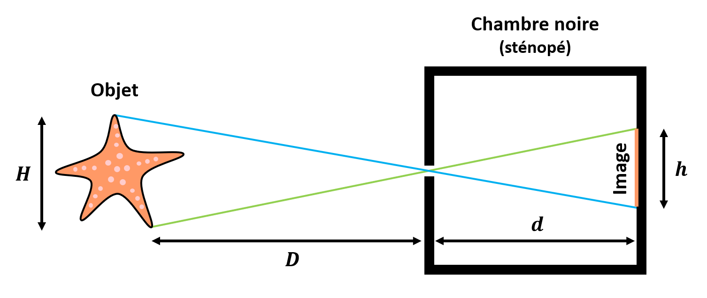

Dans la réalité, un trou infinement petit est bien entendu absurde.
Le choix de la **taille du trou** sera **un compromis entre 2 limites physiques** :

* Plus le trou sera grand, et moins l'image sera "nette", car moins directive sera la projection.

* Plus le trou est petit, et plus nous nous éloignons du domaine optique.
En effet, la lumière est une onde, et apparaissent alors des effet de diffraction, qui vont déformer l'image.

Vers la fin du XIXème siècle, Rayleigh propose la formule empirique suivante pour la détermination de la taille idéale du trou :

$1.9 \sqrt{d \times \lambda}$

avec $\lambda$ la longueur d'onde de la lumière, que l'on considère souvent comme ayant une médiane à 550 nm dans le visible.

Donc, pour une chambre noire dont la boite fait 20 cm, on choisira un trou d'un diamètre d'environ 0.6 mm.

Les chambres noires ont longtemps été utilisées pour aider les peintres à représenter le réel en 2D : il suffit de dessiner par dessus l'image projetée.
Elles ont aussi aidé les astronomes à observer le soleil et ses éclipses, qui ne peuvent être regardées direct.

|Nota Bene|
|:-|
|Vous l'aurez probablement remarqué : ce type de caméra a un fonctionnement équivalent aux yeux du nautile.|

Ce système a cependant un gros désavantage : la **luminosité**.

On imagine en effet facilement qu'en limitant la lumière entrant dans la chambre noire à un trou de moins de 1 mm, on réduit grandement la quantité de lumière servant à former l'image.
C'est pourquoi à partir du XVIème siècle, on commencera progessivement à remplacer le trou des chambres noires par des **lentilles**.

### L'objectif photographique

En optique, on appelle "**lentille**" un morceau de matériau **isotrope**, **transparent** (réfléchissant peu la la lumière visible) et **réfringent**, dont la forme permet de faire **converger** ou **diverger** les rayons lumineux qui le traversent.

Tout comme la "chambre noire", le principe de la lentille est connu depuis l'antiquité :

Les lentilles **convergentes** ont d'abord été utilisées en complément du système humain, pour grossir un texte (principe de la loupe), puis au moyen-âge pour aider les personnes ayant des problèmes de vue (principe des lunettes).
Avec l'amélioration des techniques de fabrication des lentilles, au XVIIème siècle sont inventés le microscope et le téléscope.

Comme nous l'avons mentionné, c'est à cette période aussi que les chambres noires commencent à utiliser des lentilles convergentes plutôt qu'un sténopé.

Là où le sténopé va essayer de restreindre la lumière reçue en un point de l'image à une direction, une lentille convergente va chercher à **dévier la lumière diffusée dans différentes directions** par un point d'un objet **vers un même point de l'image**.

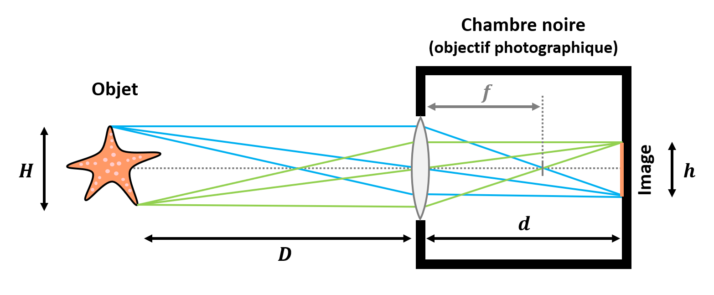

On comprend alors sans mal qu'avec une lentille **beaucoup plus de lumière** provenant de l'environnement est utilisée pour former l'image au fond de la chambre noire.

Une **lentille convergente** parfaite est caractérisée par sa **distance focale** $f$, c'est-à-dire la distance au centre de la lentille du point vers lequel convergent tous les rayons arrivant dans l'axe de la lentille.
En optique, on appelle se point le "foyer".

C'est cette propriété qui va définir la distance $d$ à laquelle se forme l'image d'un objet se trouvant à une distance $D$, suivant la formule :

$\frac{1}{f} = \frac{1}{d} + \frac{1}{D}$

La taille $h$ de l'image de cet objet de taille $H$ se calcule alors de la même façon que pour le sténopé :

$\frac{h}{H} = \frac{d}{D}$

Par exemple, pour une lentille de 20 cm de distance focale, un objet situé à 1 m aura son image projetée à 25 cm.
Si l'objet fait 10 cm, sa taille sur l'image projetée sera de 2.5 cm.

Si le fond de la chambre noire se trouve exactement à la distance $d$ de la lentille, on dira que cet objet est "**net**" sur l'image.

On remarque alors que pour obtenir une image "nette" d'un objet situé à une certaine distance, il faut adapter $f$ ou $d$, ce qui implique de pouvoir **changer la lentille** ou **changer sa position** par rapport au fond de la caméra.
Choisir une configuration de $f$ et $d$ pour rendre un objet net sur l'image s'appelle faire la "**mise au point**".

Un photographe peut en général déplacer la lentille avec une bague pour modifier $d$, ou changer d'objectif pour modifier $f$.

Contrairement au sténopé, on ne peut donc pas avoir tous les objets de l'environnement "nets" sur une même image avec ce type de caméra.
En revanche, nous verrons dans la suite qu'il est possible d'adapter la zone dans laquelle les objets peuvent être considérés comme "suffisamment nets", lorsque nous introduirons la notion de "profondeur de champ optique". 

|Nota Bene|
|:-|
|Vous l'aurez probablement remarqué : ce type de caméra fonctionne sur le même principe que l'oeil humain.|
|Les yeux des mammifères sont capables de modifier la distance focale du cristallin, la "lentille" naturelle.|
|Chez les poulpes et les seiches, c'est la distance du cristallin à la rétine qui peut être modifiée.|

Dans la réalité, une lentille convergente "parfaite" **n'existe pas** : aucune lentille n'est infiniment mince, parfaitement isotrope, au coefficient de réfraction constant avec la longueur d'onde, etc.

Ceci entraine des défauts sur l'image projetée appelés "**aberrations optiques**".
En voici quelques exemples :

* La **aberrations géométriques** :

Les rayons lumineux traversant une lentille parallèlement à son axe ne passent jamais tous exactement par le foyer quelque soit leur distance à l'axe.
Ces petits décalages auront tendance à dégrader la netteté de l'image, voir à la déformer.

* Les **aberrations chromatiques** :

Les rayons lumineux de différentes longueurs d'onde ne sont jamais dévié avec le même angle par une lentille.
En effet, le coefficient de réfraction d'un matériau dépend toujours plus ou moins de la longueur d'onde de la lumière.
On appelle se phénomène la "**dispersion**".
La distance focale de la lentille va donc légèrement varier avec la longueur d'onde, ce qui provoque un décalage des couleurs sur l'image.

* Les **réflexions et diffusions internes** :

Une lentille n'est jamais complètement transparente.
Il y a des réflexions multiples et de la diffusion de la lumière au sein du matériau.
Ceci peut provoquer des artéfacts dans l'image, le plus connu étant le "facteur de flare".

* Les **défauts** de la lentille :

Le moindre défaut de la lentille peut impacter l'image obtenue.
Une poussière, un impact, une inclusion dans le matériau peut provoquer des artéfacts visibles.

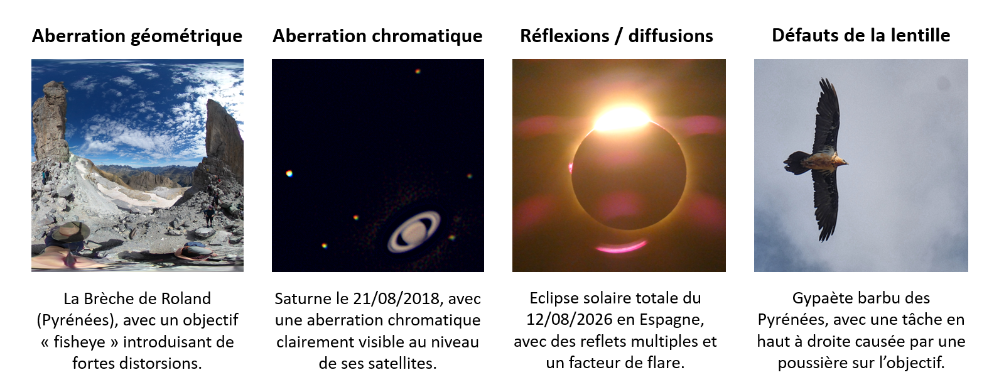

Pour lutter contre ces désavantages connus de l'utilisation d'une lentille convergente par rapport au sténopé, les caméras modernes n'utilisent plus une lentille convergente simple, mais un système optique composé de **multiples lentilles**, appelé "**objectif photographique**".

En général, l'objectif d'une caméra permet d'adapter la distance focale du système, ainsi que de corriger certaines des aberrations dont nous avons parlé.

Nous parlerons plus en détails dans la suite des paramètres photographiques sur lesquels on peut jouer lors d'une acquisition d'image.

|Nota Bene|
|:-|
|Il est à noter que les aberrations présentées ici sont parfois recherchées pour certaines applications.|
|Par exemple, le facteur de flare est souvent recherché en photographie artistique pour son côté esthétique.|
|Ou encore, les aberrations géométriques peuvent être recherchées dans la cas de la photographie 360° par un objectif "fisheye".|

Nous avons à présent un système capable de former une image dans une chambre noire.
Reste un problème : comment capter cette image ?

### La photographie argentique

En 1827, Nicéphore Niépce réalise ce qui est à ce jour la photographie la plus ancienne qui nous soit parvenue : Le _Point de vue du Gras_.

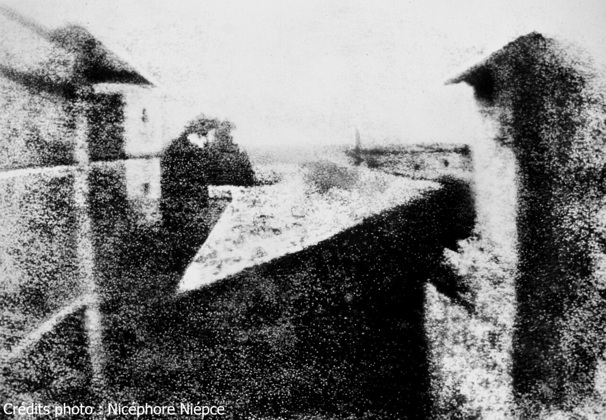

Elle représente le domaine du Gras, maison de Niépce en Saône-et-Loire.
Pour l'obtenir, il a utilisé un procédé de son invention, qu'il a appelé "héliographie".
Il s'agit d'une chambre noire, avec une lentille convergente, et un système de fixation d'image à base de "bitume de Judée".

Le "bitume de Judée" est un matériau **photosensible**, c'est-à-dire que ses propriétés physiques changent lorsqu'il est exposé à la lumière.
Niépce recouvre une plaque de métal d'un vernis contenant du bitume dissous, et la place au fond de la chambre noire.
Quand il est exposé à la lumière, le bitume durçit et devient moins soluble.
Il suffit alors de nettoyer la plaque pour retirer le bitume des zones de la plaque où il n'a pas durcit.

On obtient alors une **impression en noir et blanc** de l'image formée par la lentille au fond de la chambre noir.

Le principal problème de ce procédé ? **Le temps de pose**.

En effet, selon certaines estimations, il a fallu que la plaque soit exposée plus d'une journée pour obtenir cette photographie !
Un temps bien trop long pour espérer capturer autre chose que des natures mortes ou des paysages.

Niépce s'associe avec le peintre Louis Daguerre, qui a entendu parler de son invention.
Ensemble, ils vont améliorer le processus, réduisant le temps de pose nécessaire à quelques dizaines de minutes.
Daguerre profitera de la mort de Niépce en 1833 pour s'attribuer la paternité de l'invention, qu'il nommera humblement "**daguerréotype**" en 1835.
Le brevet est acheté en 1839 par l'état français, qui "l'offre au monde entier" en le rendant public.

Le Daguerreotype utilise un nouveau matériau photosensible : **l'iodure d'argent**.
Voici le principe :

* L'**exposition** à la lumière :

Une couche d'argent est déposée sur un support au fond de la chambre noire.
On expose la plaque à de l'iode, pour produire de l'iodure d'argent.
On laisse l'iodure d'argent réagir à la lumière quelques dizaines de minutes.

* Le **développement** de l'image :

Une "**image latente**", invisible, s'est formée sur la plaque.
Pour faire apparaitre l'image, il faut exposer la plaque à des vapeurs de mercure.
Le mercure se condense sur l'iodure d'argent, proportionnellement à son exposition à la lumière, faisant apparaitre l'image.

* La **fixation** de l'image :

L'image formée à ce stade est très fragile, et risque de disparaitre avec une nouvelle exposition à la lumière.
Pour la figer, on la trempe dans une solution d'hyposulfite de soude, puis on la lave de tout matériau photosensible non figé.

Si les techniques photographiques ont beaucoup évolué au court du XIXème puis du XXème siècle, ces 3 grandes étapes restent : **exposition** à la lumière d'un matériau photosensible, **développement** de l'image latente obtenue, **fixation** de l'image.
Une autre constante est l'utilisation de matériaux photosensibles à base d'argent, d'où le nom de **photographie argentique**.

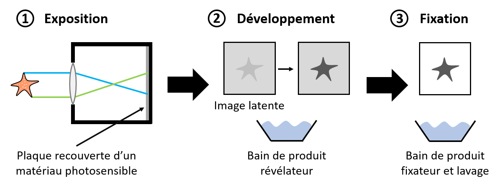

L'inventeur William Henry Fox Talbot brevète en 1841 le "**calotype**", qui utilise comme support du papier recouvert d'iodure d'argent, et permet de réaliser des photographies en "**négatif**".
Ceci est particulièrement pratique pour **imprimer plusieurs tirages** à partir d'une photographie négative.
En 1847, l'imprimeur Louis Désiré Blanquart-Evrard arrive à réduire le coût de cette technique en utilisant du blanc d'oeuf pour la fixation de l'image : c'est le "**papier albuminé**".
Il créé dans la foulée en 1851 une des 1ères imprimeries photographique du monde, dans la région de Lille.

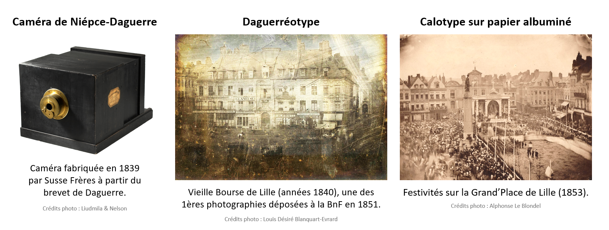

En 1888, l'entrepreneur George Eastman, fondateur de l'entreprise Kodak, commercialise les premières **pellicules photographiques**, démocratisant encore plus la photographie.

Jusqu'à la fin du XXème siècle, les appareils photographique utilisaient donc ces "**pellicules**", un film plastique recouvert d'une émulsion contenant des cristaux de **bromure d'argent**, photosensibles.
Un même appareil pouvait prendre plusieurs photographies d'affilée, en faisant simplement défiler la pellicule.
En général, on confiait ensuite à un professionnel le soin de développer et fixer les photographies enregistrées sur la pellicule.

_Et pour les couleurs ?_

Si des procédés de photographie en couleurs existent depuis 1861 (invention de Thomas Sutton), ils restent pendant longtemps des processus complexes et nécessitant des temps d'exposition trop longs.
Ce n'est que dans les années 1930 que des pellicules "couleur" apparaissent sur le marché, et que dans les années 1960-1970 qu'elles deviennent suffisamment peu chères pour se démocratiser.

Les pellicules couleur étaient constituées de **plusieurs couches** d'émulsions de bromure d'argent, avec des **filtres** pour les rendre sensibles à différentes longueurs d'ondes, à la manière des cônes de notre oeil.
Le processus de développement a également été adapté pour faire apparaitre les images captées par les différentes couches de la couleur voulue.

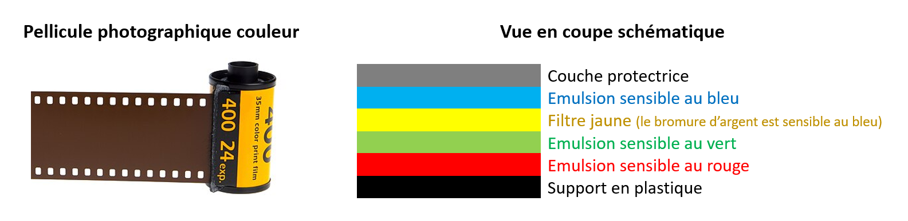

Nous reparlerons dans la suite de la synthétisation des couleurs.

|Nota Bene|
|:-|
|La pellicule étant beaucoup plus petite que les supports précédemment utilisés, il faut ajouter une étape de **grossissement** de l'image par projection.|

Si la **photographie argentique** permet de capter l'image projetée par la caméra, il s'agit d'un enregistrement **analogique**.
Or, pour faire de la vision par ordinateur, il nous faut un enregistrement **numérique**.

### La photographie numérique

Si les premiers développements en **photographie numérique** remontent aux années 1970, ce n'est qu'au début du XXIème siècle qu'elle se démocratise, jusqu'à remplacer la photographie argentique auprès du grand public.

Une caméra "**numérique**" est caractérisée par les éléments suivants :

* Un "**capteur photographique**" remplace la pellicule et fait office de "rétine" :

Il s'agit d'une matrice de composants électroniques appelés "**photosites**", capables de convertir de l'énergie lumineuse en **énergie électrique**.
Pour ce faire, les photosites utilisent un type de composants appelé "**photodiodes**".
Une photodiode contient du **silicium dopé** pour être **semi-conducteur**.
L'idée est qu'un photon capté va créer une paire électron-trou au sein du semi-conducteur.

* Le signal obtenu par chaque photosite est en général **amplifié**.

Mais il faut noter que l'effet photoélectrique utilisé par les photosites a un meilleur rendement que l'effet photochimique utilisé par les pellicules argentiques.
C'est-à-dire qu'un proportion plus grande des photons incidents sont captés par un capteur photographique.

* Un convertisseur analogique-numérique (CAN) va **numériser** ces signaux.

Nous reparlerons plus loin des aspects de "numérisation" (échantillonnage / quantification) d'une image.

* La matrice des signaux obtenus va être **encodée** selon un format définit, et **enregistrée** sur un support physique (en général une "carte mémoire").

On obtient ainsi une image en nuances de gris.
Pour obtenir une image **en couleurs**, il faut ajouter les éléments suivants :

* Une matrice de **filtres colorés** avant le capteur photographique :

L'idée est d'imiter la rétine humaine, avec un tapis de "photorécepteurs" sensibles à 3 longueurs d'onde différentes.
En général, on choisi la "**mosaïque de Bayer**", qui réparti des filtres rouges / verts / bleus avec les proportions 25% / 50% / 25%, pour reproduire le fait que le pic de sensibilité de la vision humaine est **proche du vert**.

* Une étape de traitement entre la numérisation et l'encodage, que l'on appelle "**dématriçage**" :

Les photocites dédiés aux 3 couleurs sont distribués sur le capteur, avec en plus un déséquilibre dans leur répartition.
Or, nous avons besoins de mesures de rouge / vert / bleu pour une même position sur l'image projetée sur le capteur.
On réalise donc des **interpolations 2D**.

Quelques corrections numériques peuvent également être apportées aux données avant encodage.

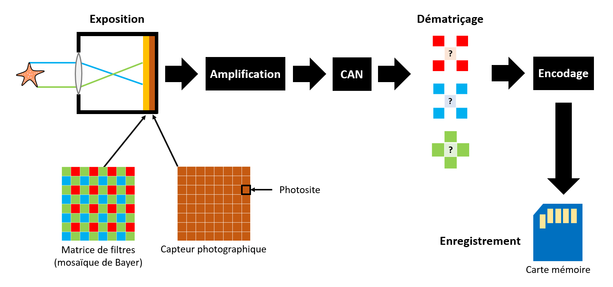

Les capteurs photographiques sont

Il existe **2 grandes technologies** de **capteurs photographiques** : 

* Les capteurs **CCD** :

"Charge Coupled Device".
Ce type de capteur est constitué d'une matrice de **photosites passifs**.
Lorsqu'ils sont illuminés par des photons, ils **accumulent des charges**.
Les charges sont ensuite **transférées** électrostatiquement au pixel du dessous, afin d'être lues **ligne par ligne** par un "registre de lecture".
Enfin, les charges d'une ligne sont une à une **converties en tensions**, et transmises à l'amplitificateur puis au CAN de la caméra.

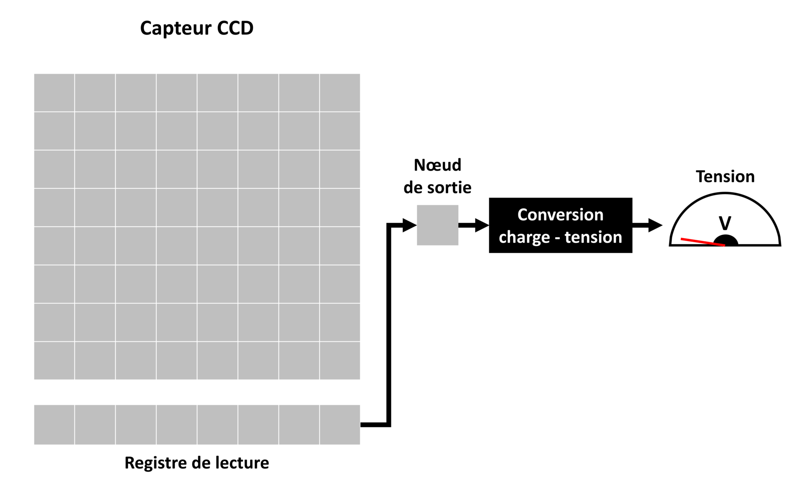

* Les capteurs **CMOS** :

"Complementary Metal Oxide Semiconductor".
Ce type de capteur est constitué d'une matrice de **photosites actifs**.
Chaque photosite contient des **transistors**, qui permettent de **convertir les charges accumulées en tension**, et de **sélectionner le photosite** dont on veut lire la tension avec un sélectionneur de **ligne** puis un sélectionneur de **colonne**.
Les tensions sont lues ligne par ligne, puis colonne par colonne, puis transmises à **une ligne de CAN**.

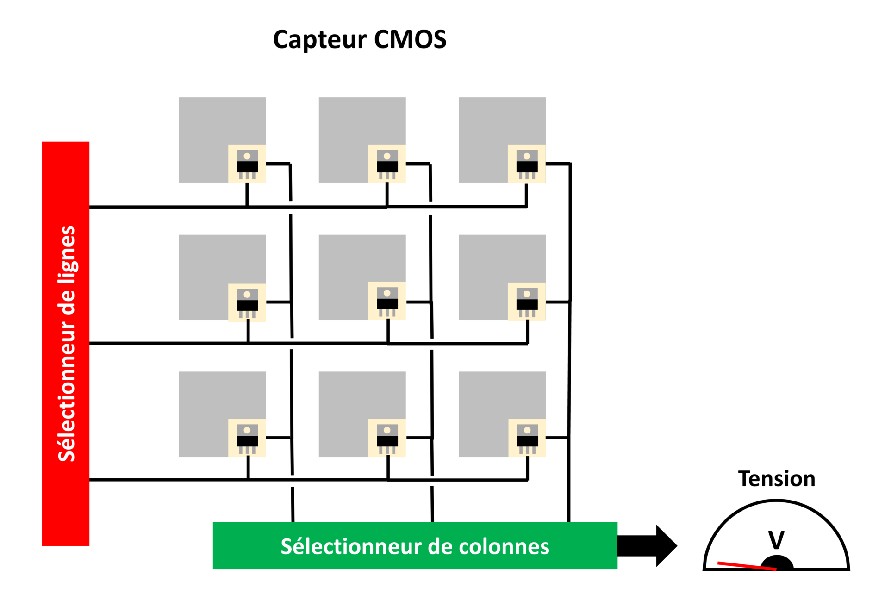

Historiquement, les capteurs CCD sont plus anciens (1969) que les capteurs CMOS (1992).
A partir de 2004, les capteurs CMOS deviennent plus utilisés en photographie numérique que les capteurs CCD, jusqu'à devenir ultra-dominants aujourd'hui.

Les capteurs CMOS ont en effet les avantages suivants comparés aux CCD : **plus rapides**, **moins gourmants en énergie**, et **moins coûteux**.
Si les capteurs CMOS avaient originellement un bruit plus élevé que les CCD, ce retard a depuis été rattrapé.

Néanmoins, les capteurs CCD restent utilisés dans des domaines spécifiques, par exemple en astronomie ou en spectrométrie.
En effet, l'indépendance des photosites d'un CMOS rend la mesure de tension moins homogène et moins linéaire, des propriétés importantes pour certaines applications.

Dans la suite de ce cours, nous ne parlerons plus que de **photographie numérique**.

### Réglages d'une caméra

Lorsque l'on utilise une caméra, il y a **3 principaux réglages** sur lesquels jouer pour acquérir une image d'une scène : **vitesse d'obturation**, **sensibilité ISO** et **ouverture**.
Ces 3 paramètres vont définir ce que l'on appelle l'**exposition** et la **profondeur de champ** optique.

Parlons d'abord de l'**exposition**.
Il s'agit de la quantité de lumière reçue par le capteur phographique.

Cette grandeur est liées à nos 3 paramètres par ce que l'on appelle parfois le "**triangle d'exposition**".

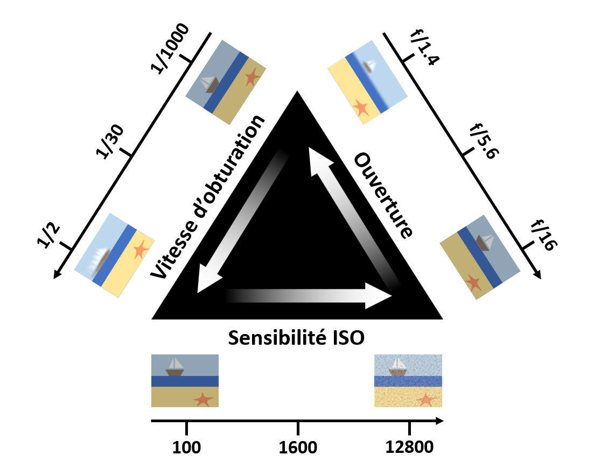

L'idée est que pour une application de vision donnée, **on cherche le meilleur compromis** entre ces 3 paramètres sur ce triangle.

#### La vitesse d'obturation

On parle aussi de "temps de pose" ou "temps d'exposition".
Il s'agit de la **durée pendant laquelle on expose à la lumière** le capteur photographique pour acquérir une image.

Historiquement, les caméras disposaient d'un système mécanique masquant la pellicule ou le capteur, appelé "**obturateur**".
Aujourd'hui, l'obturation se fait souvent de manière électronique, en activant / désactivant le capteur.

Il est en général exprimé en **fraction de seconde**, et nous le noterons $t$.

Son choix est un compromis, choisi en fonction de la **luminosité** de la scène et de la **vitesse de déplacement** des objets.
En effet, un temps de pose long permet de rendre l'image plus lumineuse, mais risque de rendre flou des objets en mouvement.

Pour donner un ordre d'idée, pour de la photographie sportive, on prendra de l'ordre de 1/1000 s, alors que pour photographier la lune on prendra de l'ordre de 1/250 s.
Notre image exemple d'_Ocypode quadrata_ a par exemple été prise avec une vitesse d'obturation de 1/1600 s, cohérent pour de la photographie animalière.

Voici un exemple poussé à l'extrême : une photographie de nuit sur une plage de l'île de la Réunion, prise avec un **long temps d'exposition de 30 secondes** (vitesse d'obturation très faible).

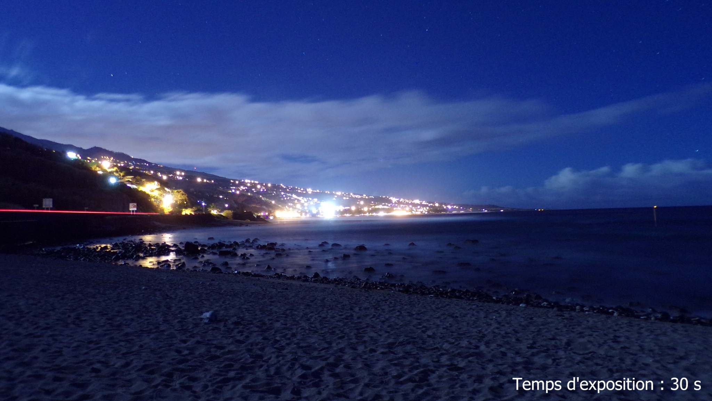

Un temps de pose aussi long permet de faire apparaitre la plage, la mer, les rochers, et même quelques étoiles dans le ciel nocturne.
Par contre, les objets en mouvement tels que les vagues, les nuages, et les voitures sur la route cotière sont flous.
Quelques lumières de la ville ont également tendance à "éblouir" le capteur.

#### L'ouverture

Nous l'avons déjà evoqué, l'oeil humain possède un **diaphragme**, appelé "iris", qui permet d'adapter la quantité de lumière atteignant la rétine.
C'est aussi le cas de nombreuses caméras.

On appelle "**ouverture**" le paramètre noté $N$, grandeur sans dimension :

$N = \frac{f}{\phi}$

avec $f$ la distance focale de la lentille, et $\phi$ le diamètre de la "pupille" du diaphragme.
On parle aussi de "nombre d'ouverture".

Les photographes le notent souvent sous la forme "$f/$", par exemple pour $N = 5.6$ on notera $f/5.6$.

Le lien entre l'ouverture du diaphragme d'une caméra, et la quantité de lumière arrivant au capteur parait évident.
Mais, l'ouverture ne permet pas de régler que l'exposition.
Elle permet aussi de régler ce que l'on appelle la "**profondeur de champ**" optique.

Comme expliqué plus tôt, un sténopé parfait permet en théorie d'obtenir une image nette sur le fond de la caméra, quelque soit la distance de l'objet.
Mais cette image est peu lumineuse.
Une lentille parfaite quant à elle, à distance constante du fond de la caméra, ne permet d'obtenir une image nette que pour des objets à un distance précise.
Mais cette image est plus lumineuse.

En ajoutant un diaphragme à une caméra ayant une lentille, on cherche **un compromis** entre les 2 solutions.

Le diaphragme va réduire les angles d'incidence possibles pour la lumière diffusée par un même point d'un objet.
Si l'objet est plus proche ou plus loin que la distance de mise au point, cela va réduire la surface éclairée par un même point de l'objet sur le capteur photographique.
Dans le cas où l'objet est exactement à la distance de mise au point, la zone éclairée restera ponctuelle.

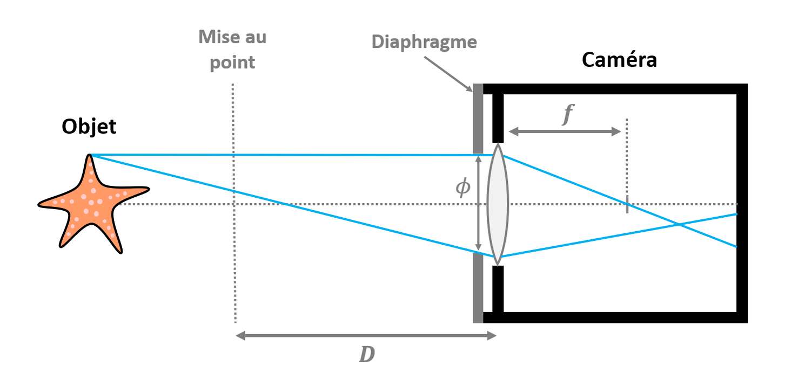

La **profondeur de champ** est la zone autour de la distance de **mise au point** pour laquelle on considère que l'image d'un objet sera "**suffisamment nette**".

Voici pour illustrer une photographie d'un insecte longicorne sur un rondin de bois :

La mise au point a été faite sur l'insecte, et on peut discerner assez facilement la zone trop proche pour être nette, la zone "suffisamment nette" autour de la distance de mise au point, et la zone trop loin pour être nette.

La notion de profondeur de champ est liée à celle de "**cercle de confusion**" : il s'agit du diamètre maximum d'un cercle sur le capteur photographique au sein du lequel tous les rayons reçus seront considérés comme **un même point de l'image**.
On note en général ce diamètre $c$.

Le diamètre du cercle de confusion permet de déterminer permet de déterminer l'**hyperfocale** de l'appareil : la distance minimum pour laquelle on peut faire la mise au point en gardant les objets "suffisamment nets" jusqu'à l'infini.
On la note en général $H$.
L'image sera alors considérée comme nette de $H/2$ à l'infini.

$H = \frac{f^2}{N c} + f \approx \frac{f^2}{N c}$

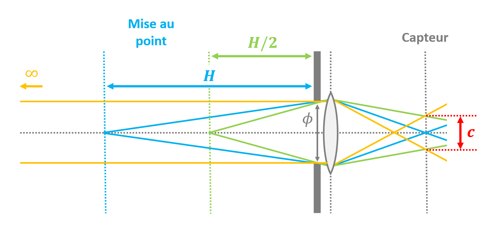

|Nota Bene|
|:-|
|L'hyperfocale est la distance de mise au point pour un objectif et un capteur donnés qui permet de **maximiser la profondeur de champ**.|
|C'est donc souvent le **réglage par défaut** choisi par un photographe qui ne sait pas quelle ouverture choisir.|

Notons $D$ la distance de mise au point d'un objet.
On peut montrer que la distance la plus proche considérée comme nette est :

$D_1 = \frac{H D}{H+D}$

Dans le cas ou $D < H$, on peut également montrer que la distance la plus lointaine considérée comme nette est :

$D_2 = \frac{H D}{H-D}$

La zone considérée comme nette sera alors l'intervalle de distance $[D-D_1;D+D_2]$.

Sinon, on considère que $D_2$ tend vers l'infini, et l'intervalle devient $[D-D_1;\infty]$.

On en déduit que dans le cas où $D < H$, la profondeur de champ s'exprime :

$\Delta D = D_2 - D_1 = \frac{2 H D^2}{H^2 - D^2}$

Sinon, la profondeur de champ sera considérée comme infinie.

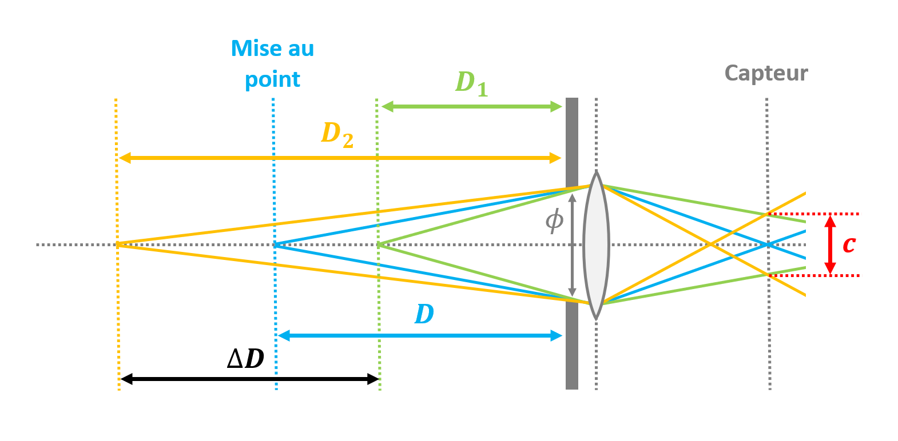

Lorsque l'on utilise une caméra, il faut donc **choisir l'ouverture** en fonction de l'**exposition** et de la **profondeur de champ** voulue.
Ceci implique d'avoir un a priori sur les distances des objets d'intérêt pour une application de vision donnée.

Notre image exemple d'_Ocypode quadrata_ a par exemple été prise avec une ouverture de $f/4.5$, et une distance focale $f = 15 mm$.
Admettons que pour la caméra utilisée, $c = 5 µm$.
On en déduit que :

$H \approx 10 m$

Si on considère que le crabe sur lequel on a fait la mise au point était à 1 m de la caméra (c'est-à-dire $D = 1 m$), alors :

$D_1 \approx 0.91 m$ et $D2 \approx 1.11 m$

Soit une profondeur de champ $\Delta D \approx 20 cm$.

|Nota Bene|
|:-|
|Parfois, une profondeur de champ très faible est recherchée pour un effet artistique.|
|Cet effet est appelé en photographie le "bokeh", mot venant du japonais et signifiant "flou".|

#### La sensibilité ISO

Bien qu'elle soit représentée sur le triangle d'exposition, **la **sensibilité ISO n'influe pas sur l'exposition**, dans le sens où elle ne permet pas de régler la quantité de lumière arrivant au capteur, contrairement à la vitesse d'obturation et à l'ouverture.
La sensibilité ISO modifie l'**amplification** du signal transmis par le capteur photographique.

Il s'agit d'une **norme** définie par l'organisme "ISO" (d'où son nom), d'abord pour les pellicules puis pour les capteurs photographiques.

Un indicateur d'exposition a été créé par un fabricant d'objectifs photographiques dans les année 1950 : l'**EV** ou "indice de lumination" en français.
Il est définit comme :

$EV = log_2(\frac{N^2}{t})$

Ce critère est fait pour **augmenter quand la quantité de lumière diminue** : la quantité de lumière augmente avec $t$, et diminue avec $N^2$ car elle augmente avec la surface du trou du diaphragme.
Ce critère est également fait pour que +1 EV représente une **multiplication par 2** de la quantité de lumière.

Pour un même objet illuminé de la même façon, 2 combinaisons vitesse d'obturation / ouverture donnant le **même EV** donneront une **même exposition**.

Mais si la sensiblité ISO change, **l'image obtenue sera différente**, car l'amplification du signal du capteur photographique sera différente.
En gardant EV constant, augmenter la sensibilité ISO donnera une image plus "lumineuse".

Donc, lorsque l'on choisi une valeur de EV pour obtenir une exposition adaptée à une application donnée, on le fait **pour une certaine sensibilité ISO** du capteur photographique.
En général, on donne par **convention** des tableaux des valeurs de EV **pour ISO 100**, que l'on note $EV_{100}$.

Voici un tableau de valeurs de $EV_{100}$ pour des vitesses d'obturation et ouvertures typiques :

|     |1 s|1/2 s|1/4 s|1/8 s|1/15 s|1/30 s|1/60 s|1/125 s|1/250 s|1/500 s|1/1000 s|
|:---:|:-:|:---:|:---:|:---:|:----:|:----:|:----:|:-----:|:-----:|:-----:|:------:|
|f/1.4|1  |2    |3    |4    |5     |6     |7     |8      |9      |10     |11      |
|f/2  |2  |3    |4    |5    |6     |7     |8     |9      |10     |11     |12      |
|f/2.8|3  |4    |5    |6    |7     |8     |9     |10     |11     |12     |13      |
|f/4  |4  |5    |6    |7    |8     |9     |10    |11     |12     |13     |14      |
|f/5.6|5  |6    |7    |8    |9     |10    |11    |12     |13     |14     |15      |
|f/8  |6  |7    |8    |9    |10    |11    |12    |13     |14     |15     |16      |
|f/11 |7  |8    |9    |10   |11    |12    |13    |14     |15     |16     |17      |
|f/16 |8  |9    |10   |11   |12    |13    |14    |15     |16     |17     |18      |
|f/22 |9  |10   |11   |12   |13    |14    |15    |16     |17     |18     |19      |

Et voici les valeurs de $EV_{100}$ pour différentes applications :

|$EV_{100}$|Application                                    |
|:--------:|:---------------------------------------------:|
|16        |Neige au soleil, plage de sable clair au soleil|
|15        |Scène ensoleillée                              |
|14        |Scène avec un ciel légèrement nuageux          |
|13        |Scène avec un ciel nuageux                     |
|12        |Scène avec un ciel très nuageux                |
|11        |Scène au soleil couchant                       |
|8         |Ville bien éclairée de nuit                    |
|6         |Concert / spectacle                            |
|4         |Eclairage domestique                           |
|3         |Ville peu éclairée de nuit                     |
|-3        |Pleine lune                                    |
|-11       |Voie lactée                                    |

Pour connaitre l'EV à régler $EV_i$ afin d'obtenir une image similaire avec une valeur d'ISO $i$ quelconque, on utilise la formule :

$EV_i = EV + log_2 (\frac{i}{100})$

Par exemple, pour photographier un concert avec une sensibilité ISO de 1600, on utilisera un EV de 10 au lieu de 6 pour ISO 100.
On pourra alors par exemple utiliser une vitesse d'obturation de 1/30 s, et une ouverture de f/5.6 (sous réserve que le profondeur de champ est acceptable).

Pour une sensibilité ISO donnée, on peut donc en théorie choisir une ouverture pour avoir une profondeur de champ adaptée à un problème de vision, puis ajuster la vitesse d'obturation pour obtenir l'EV adapté à cet ISO.
Le problème est que **si le temps de pose nécessaire est trop long**, certains objets seront potentiellement **flous**.

Idem, si à ISO constant on choisi une vitesse d'obturation adaptée à un problème, puis on ajuste l'ouverture pour obtenir l'EV adapté, on risque d'obtenir **une profondeur de champ inadaptée**.

D'où l'intérêt de pouvoir **jouer sur la sensibilité ISO**, afin d'**amplifier** le signal reçu par le capteur. 

**Mais attention**, il y a une limite dans l'ajustement de la sensibilité ISO.
Comme ce paramètre n'augmente pas réellement la quantité de lumière captée, mais amplifie le signal reçu, il va également **augmenter le bruit du capteur**.

Cet effet sera d'autant plus visible que la luminosité de la scène est faible.

Voici un exemple de photographie d'un papillon du genre _Caligo_, prise à Puerto Maldonado au Pérou.
Cette photographie a été prise de nuit, avec une illumination très faible, que l'on a tenté de compenser avec une sensibilité ISO élevée de 3200.

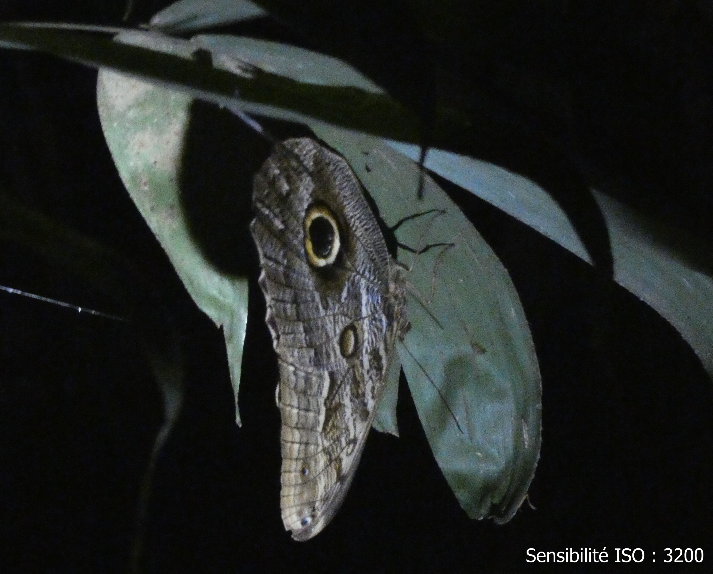

Si une telle sensibilité a permis de faire ressortir le papillon malgré l'obscurité, elle a aussi fait apparaitre le bruit du capteur.
Et le bruit est ici tellement élevé que les détails du papillon paraissent presque flous.

En général, une sensibilité aux alentours de ISO de 100 sera considérée comme faible, alors qu'une valeur au-dessus de 1600 sera considérée comme élevée et sera donc sensible au bruit.

Dans le cas de notre image exemple d'_Ocypode quadrata_, la sensibilité ISO était très faible : 80.
L'image ayant été prise en plein jour, sur une plage de sable clair bien éclairée par le soleil, une valeur faible est cohérente.

La vitesse d'obturation était de 1/1600 s, et l'ouverture était de f/4.5, ce qui correspond à une valeur de EV d'environ 15 pour ISO 80.
Si nous voulions obtenir la même image pour ISO 100, il faudrait un EV de 15.3 environ.

|Nota Bene|
|:-|
|Attention, si vous réglez +1 EV sur votre appareil photo ou sur la caméra de votre portable, l'image sera plus "claire", alors que l'on s'attend à l'inverse lorsque EV augmente.|
|C'est une convention choisie par beaucoup de fabricants, pour rendre le réglage plus instictif pour les utilisateur : on fait +1 pour augmenter l'exposition.|
|En réalité, l'exposition diminue bien quand on augmente EV.|

## Numérisation d'une image : passer du monde continu au monde discret

Le principe même de la photographie numérique est que l'on converti l'image "continue" qui se forme sur la capteur en image "**discrète**".

Cette discrétisation se fait **à plusieurs niveaux** :

* Une discrétisation **spatiale** : on transforme l'image optique en une matrice 2D, contenant des valeurs discrètes.

* Une discrétisation des **couleurs** : on transforme le ressenti des couleurs d'une image en des valeurs discrètes.

* Une discrétisation **temporelle** : dans le cas d'une vidéo, on a une succession d'images espacées par un pas de temps.

Nous allons nous développer dans ce cours le 2 premiers.

### Discrétisation spatiale

Le capteur photographique étant une matrice de photocites, on **échantillonne** spatialement l'image sous la forme d'une **matrice 2D** de tensions.
Chaque case de la matrice est appelée un "**pixel**".

Après passage dans le CAN, les tensions mesurées sont également **quantifiées**, et **encodées** en binaire sur un certain nombre de bits.

Il est évident que ces processus d'**échantillonnage** et de **quantification** vont faire perdre de l'information sur l'image, et donc sur l'environnement.
Comme pour les signaux 1D, se posera alors la question de la **fréquence d'échantillonnage**, et du **pas de quantification**.

En plus de perdre une partie de l'information, l'échantillonnage peut faire apparaitre des **artéfacts** dans l'image !

On modélise l'image optique formée sur le capteur photographique comme une fonction continue $I(x,y)$ de la position selon l'axe horizontal $x$ et selon l'axe vertical $y$ du capteur.
On considère chaque photosites comme étant carré de dimension $\delta$, on néglige les effets de la surface du photosite, et de l'intégration temporelle lié à la vitesse d'obturation.
Un échantillonnage spatial idéal donnera donc :

$I[i,j] = I(i \times \delta, j \times \delta)$

Nous noterons $f_s = \frac{1}{\delta}$ la **fréquence d'échantillonnage spatial**, homogène à des pixels / mètre.

D'après le **théorème de Nyquist-Shannon**, pour représenter discrètement un signal n'ayant pas de composantes fréquentielles supérieures à $f_{max}$, il faut choisir une fréquence d'échantillonnage $f_s$ telle que :

$f_s > 2 f_{max}$

Sinon, risque d'apparaitre un phénomène nommé "**aliasing**" (parfois appelé "repliement de spectre" en français).

Mettons que l'image formée sur le capteur présente un motif périodique selon l'axe horizontal, de fréquence $f$ et d'amplitude $A$ : 

$I(x,y) = A cos(2 \pi f x)$

Après échantillonnage, on obtient :

$I[i,j] = A cos(2 \pi f \frac{i}{f_s})$

Problème, $cos(2 \pi f \frac{i}{f_s}) = cos(2 \pi (f-f_s) \frac{i}{f_s}) = cos(2 \pi (f+f_s) \frac{i}{f_s})$

Ce qui signifie qu'une fois le signal échantillonné, une fréquence $f-f_s$ ou $f+f_s$ seront **indicernables de $f$**.
Et si le critère de Nyquist-Shannon n'est pas respecté, c'est-à-dire si $f_e \leq 2 f$, il y aura potentiellement **ambiguïté** avec d'autres composantes fréquentielles de l'image.

Voici un exemple sur une photographie de la Stavkirke de Hopperstad, en Norvège :

Les tuiles du toit du monument forment un motif périodique selon l'axe horizontal et l'axe vertical.
Si on diminue petit à petit la résolution de l'image jusqu'à ne plus respecter le critère de Nyquist-Shannon, on voit apparaitre un artefact classique que l'on appelle "**Moiré**".
Des rayures claires-foncées apparaissent sur le toit.

Il est à noter que si on considère le fait qu'une mosaïque de Bayer de filtres colorés est utilisée par les caméras numériques, l'aliasing va aussi créer des artefacts dans les couleurs.

Pour éviter les artefacts liés à l'échantillonnage, on utilise des dispositifs **anti-aliasing** à 2 niveaux :

* Les caméras numériques possèdent un filtre optique, qui va très légèrement flouter l'image avant son arrivée sur le capteur.

* Lorsque l'on réduit la résolution d'une image avec un logiciel de traitement, le logiciel utilise en général une méthode d'interpolation.

Le principe est le même dans les 2 cas : un **filtrage passe-bas** de l'image avant échantillonnage, avec une fréquence de coupure choisie pour s'assurer que l'on respecte le critère de Nyquist-Shannon.

|Nota Bene|
|:-|
|Nous avons présenté ici une image numérique comme étant une matrice 2D.|
|En réalité, c'est ce que l'on appelle une "image matricielle", et il existe d'autres types d'images, notamment les images "vectorielles".|
|Dans ce cours, nous ne parlons que d'images matricielles.|

### Discrétisation des couleurs

### Formats et compression

## L'écran : reproduire le réel

## Manipuler des images avec Python

### Pillow

### Scikit-image

### Open-CV

## Retouche d'images : améliorer la lisibilité

### Luminosité

### Contraste

### Saturation

## Les histogrammes : étalonner des images

### Analyse des histogrammes

### Histogram equalization

### Histogram matching

## A la recherche des dimensions perdues

### La stéréoscopie

### Le flux optique

## La vision par ordinateur

### Classification d'images

### Localisation d'objets

### Segmentation d'images

### Reconstruction 3D / suivi

## Conclusion