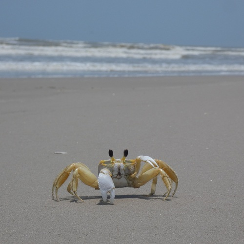
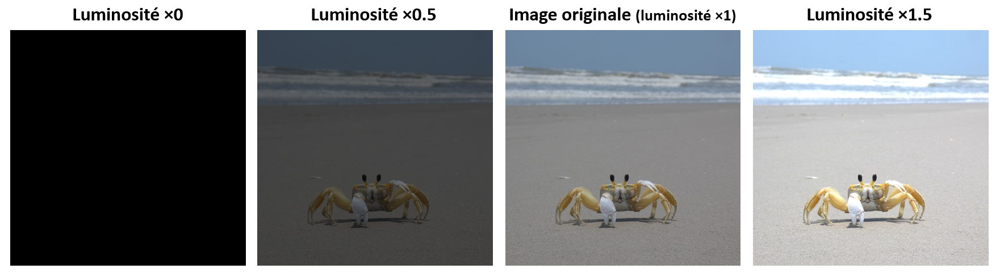
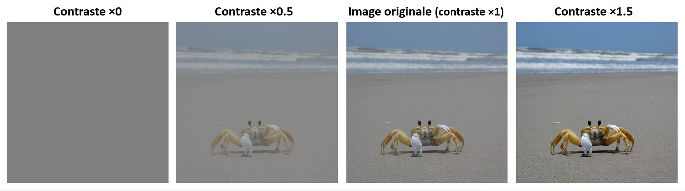
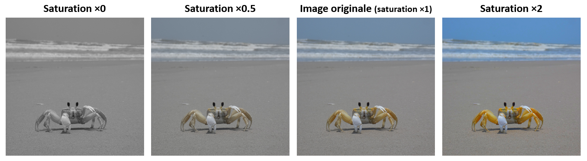
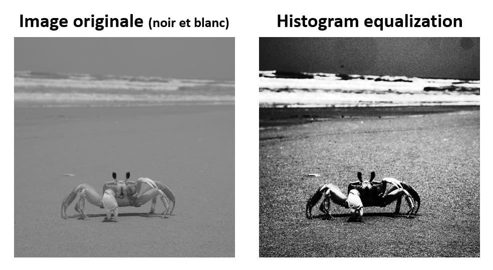
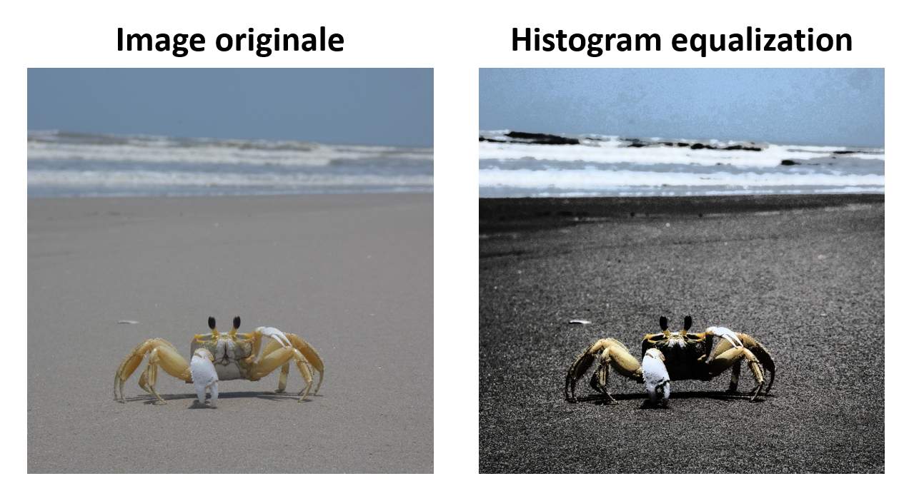
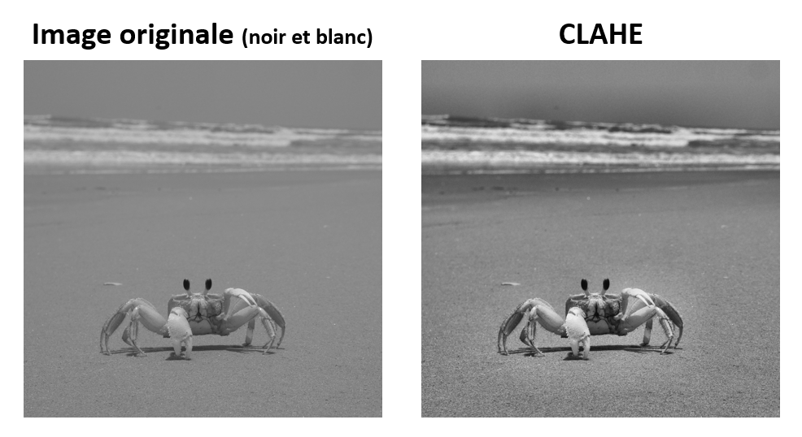
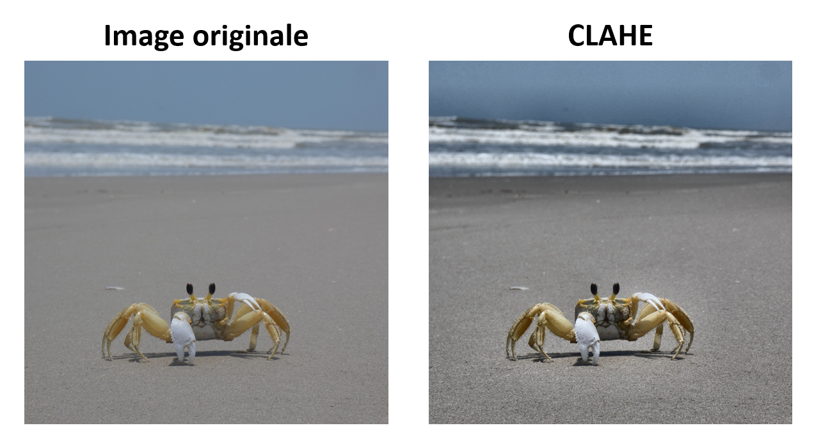
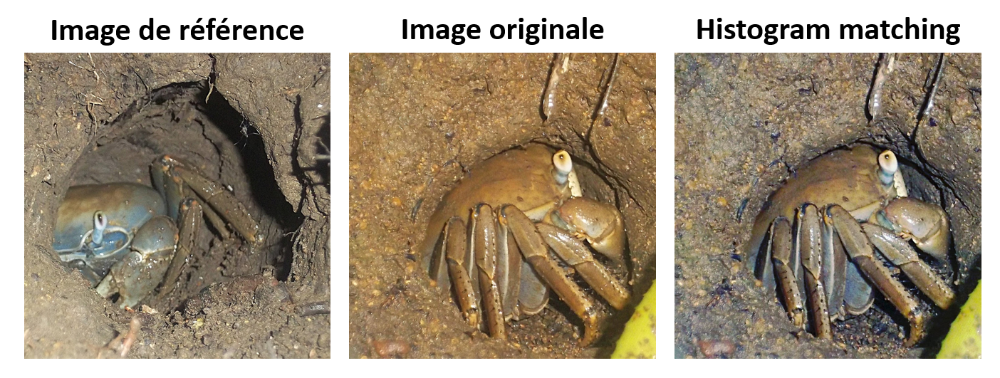

# Chapitre I : Introduction à la vision par ordinateur

Ce chapitre introduit des notions essentielles pour ce cours telles que la capture, la numérisation, l'affichage et la retouche d'images.
Il amènera ainsi petit à petit le concept de "vision", et la discipline de la "vision par ordinateur".

_"J’ai la satisfaction de pouvoir t’annoncer enfin, qu’à l’aide du perfectionnement de mes procédés je suis parvenu à obtenir un point de vue tel que je pouvais le désirer, et que je n’osais guère pourtant m’en flatter, parce que jusqu’ici, je n’avais eu que des résultats forts incomplets.
Ce point de vue a été pris de ta chambre du côté du Gras; et je me suis servi à cet effet de ma plus grande chambre obscure et de ma plus grande pierre.
L’image des objets s’y trouve représentée avec une netteté, une fidélité étonnante, jusque dans ses moindres détails, et avec leurs nuances les plus délicates."_

**Nicéphore Niépce, lettre du 16 septembre 1824, à destination de son frère Claude.**

---

## Images exemples

Ce chapitre sera illustré par quelques images exemples.

Vous trouverez la première [ici](https://github.com/NicOudart/UVSQ_EN3901_computer_vision/blob/master/images/Ghost_crab.jpg).

Il s'agit d'une photographie d'un _Ocypode quadrata_, aussi connu sous le nom de "Atlantic Ghost Crab", prise en 2023 à Padre Island National Seashore (Texas, USA).

Nous utiliserons cette image dans les cas où un seul exemple est suffisant.

Vous trouverez [ici](https://github.com/NicOudart/UVSQ_EN3901_computer_vision/blob/master/images/Land_crab_1.jpg) et [ici](https://github.com/NicOudart/UVSQ_EN3901_computer_vision/blob/master/images/Land_crab_2.jpg) deux autres images.

Il s'agit de photographies d'un _Cardisoma guanhumi_, ou "Crabe de terre blue", prises en 2012 en Guadeloupe (Antilles françaises), avec des paramètres et un angle de vue différents.

Nous utiliserons ces images dans les cas où une image de référence est nécessaire en plus d'une image exemple.

N'hésitez pas à aller regarder les détails de la prise de vue des différentes photographies dans les métadonnées des images !

---

## La vision

### Intéraction lumière-surface

### L'oeil, organe de la vision

### Le cerveau, grand illusioniste

### C'est quoi la vision ?

## La caméra : une machine à faire du 2D

### Sténopé et chambre noire

### L'objectif photographique

### La photographie argentique

### La photographie numérique

### Réglages d'une caméra 

## Numérisation d'une image : passer du monde continu au monde discret

### Discrétisation de l'image

### Encodage des couleurs

### Formats et compression

## L'écran : reproduire le réel

## Manipuler des images avec Python

### Pillow

### Scikit-image

### Open-CV

## Retouche d'images : améliorer le réel

### Luminosité

### Contraste

### Saturation

## Les histogrammes : étalonner des images

### Analyse des histogrammes

### Histogram equalization

### Histogram matching

## A la recherche des dimensions perdues

### La stéréoscopie

### Le flux optique

## La vision par ordinateur

### Classification d'images

### Localisation d'objets

### Segmentation d'images

### Reconstruction 3D / suivi

## Conclusion