# Chapitre I : Introduction à la vision par ordinateur

Ce chapitre introduit des notions essentielles pour ce cours telles que la capture, la numérisation, l'affichage et la retouche d'images.
Il amènera ainsi petit à petit le concept de "vision", et la discipline de la "vision par ordinateur" (ou "computer vision" en anglais).

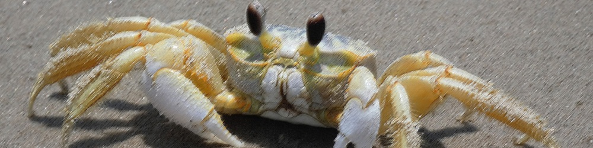

_"J’ai la satisfaction de pouvoir t’annoncer enfin, qu’à l’aide du perfectionnement de mes procédés je suis parvenu à obtenir un point de vue tel que je pouvais le désirer, et que je n’osais guère pourtant m’en flatter, parce que jusqu’ici, je n’avais eu que des résultats forts incomplets.
Ce point de vue a été pris de ta chambre du côté du Gras; et je me suis servi à cet effet de ma plus grande chambre obscure et de ma plus grande pierre.
L’image des objets s’y trouve représentée avec une netteté, une fidélité étonnante, jusque dans ses moindres détails, et avec leurs nuances les plus délicates."_

**Nicéphore Niépce, lettre du 16 septembre 1824, à destination de son frère Claude.**

---

## Images exemples

Ce chapitre sera illustré par quelques images exemples.

Vous trouverez la première [ici](https://github.com/NicOudart/UVSQ_EN3901_computer_vision/blob/master/images/Ghost_crab.jpg).

Il s'agit d'une photographie d'un _Ocypode quadrata_, aussi connu sous le nom de "Atlantic Ghost Crab", prise en 2023 à Padre Island National Seashore (Texas, USA).

Sauf cas spécifique, nous utiliserons cette image dans les cas où un seul exemple est suffisant.

Vous trouverez [ici](https://github.com/NicOudart/UVSQ_EN3901_computer_vision/blob/master/images/Land_crab_1.jpg) et [ici](https://github.com/NicOudart/UVSQ_EN3901_computer_vision/blob/master/images/Land_crab_2.jpg) deux autres images.

Il s'agit de photographies d'un _Cardisoma guanhumi_, ou "Crabe de terre blue", prises en 2012 en Guadeloupe (Antilles françaises), avec des paramètres et un angle de vue différents.

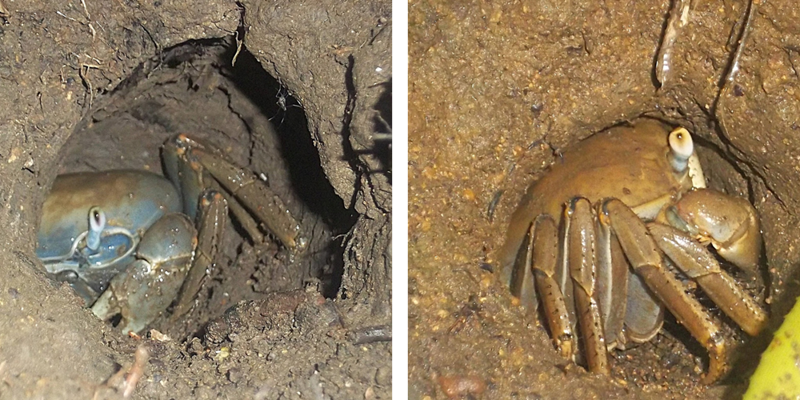

Sauf cas spécifique, nous utiliserons ces images dans les cas où une image de référence est nécessaire en plus d'une image exemple.

N'hésitez pas à aller regarder les détails de la prise de vue des différentes photographies dans les métadonnées des images !

---

## La vision

### C'est quoi la vision ?

_C'est quoi voir ?_

**La question est plus difficile qu'il n'y parait.**

Une définition pourrait être : **la vue est un sens**, commun à de nombreux animaux, qui permet de **comprendre à distance le monde qui nous entoure** à partir de la **lumière émise par des sources externes** et **réfléchie par différentes surfaces**.

On sait aussi que ce sens implique un organe sensoriel, l'**oeil**, et un organe de traitement de l'information, le **cerveau**.

_Mais comment sommes-nous capables de comprendre le monde qui nous entoure à partir de la lumière réfléchie par des surfaces ?_

Imaginez que vous assistiez à la scène suivante :

_Que voyez-vous ?_

Vous répondrez probablement : un crabe, sur la plage, avec en fond la mer et le ciel.

Vous ajouterez peut-être que le crabe est jaune et blanc, que sa pince droite est plus grande que la gauche, et qu'il a l'air de vous regarder.

Vous vous représentez probablement mentalement la plage, avec la mer au loin, et le crabe presque à vos pieds. 
Il y a de fortes chances que vous vous imaginiez proche du sol.

_Mais comment savez-vous tout ceci ?_

La vue est avant tout une **expérience sensorielle**, et comme toute expérience sensorielle, elle nous parait à la fois évidente et difficile à décrire.

Ce que l'on nomme "**vision**" n'est donc pas que la perception de la lumière provenant de notre environnement, c'est aussi un **processus cognitif complexe**, qui passe par la formation d'une **représentation 2D** de la lumière reçue appelée **image**, et son **interprétation en 3D** par l'identification de différentes zones et de leurs distances respectives.

Voyons rapidement comment ce processus fonctionne chez l'animal avant d'essayer de le reproduire avec une machine.

### Intéractions lumière-matière

La vision repose sur la perception de la **lumière** provenant de notre environnement.

On rappelle que l'on nomme "lumière" un **rayonnement électromagnétiques** dont la longueur d'onde est située **entre 380 et 780 nm**, les rendant détectables par la vision humaine.
Par extension, on parle parfois de "lumière visible" et de "lumière invisible" pour désigner des ondes électromagnétiques de longueur d'onde plus faible (infrarouge) ou plus élevée (ultraviolet).

On divise les **sources de lumières** en 2 grandes catégories :

* Les **sources primaires**, qui produisent leur propre lumière.
Dans notre environnement, c'est par exemple le cas du soleil, des étoiles, des lampes allumées, du feu, ou des vers luisants.

* Les **sources secondaires**, qui ne font que réfléchir la lumière générée par une source primaire.
C'est le cas de la plupart des objets dans notre environnement.

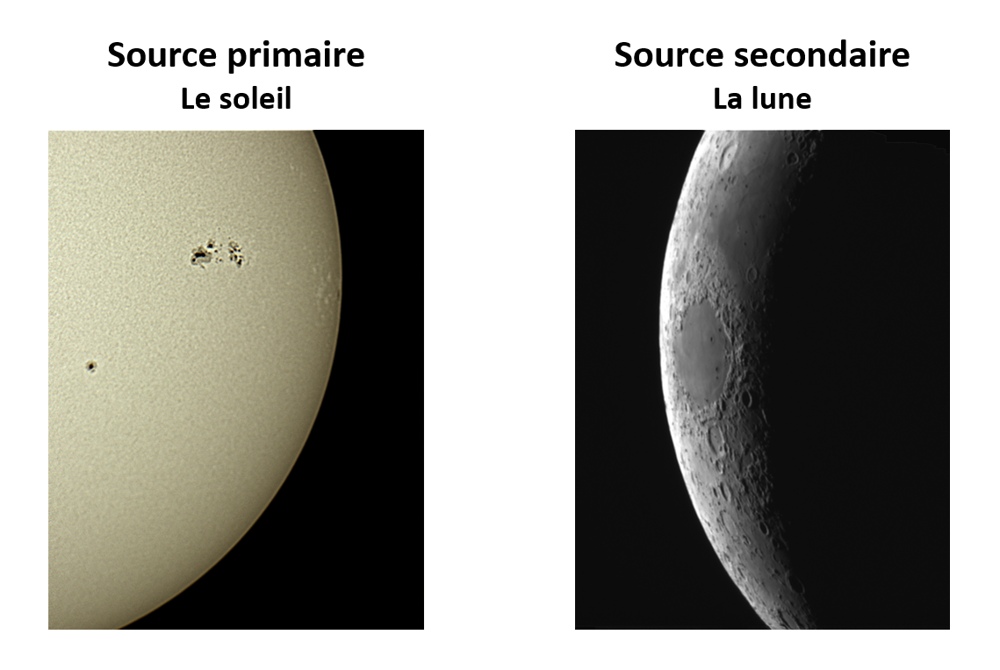

Lorsqu'une onde éléctromagnétique rencontre une interface entre 2 milieux d'indice de réfraction différents, d'après la théorie de Fresnel, elle est en partie **transmise**, en partie **absorbée**, et en partie **réfléchie**.

Notre environnement est composé de nombreux objets dont la surface représente des **interfaces avec l'air**, dont l'indice de réfraction est plus faible.
D'où le fait qu'une part de la lumière soit **réfléchie** à la surface de ces objets, en faisant des **sources de secondaires** de lumière.

En optique, on sépare les réflexions de la lumière sur une surface en 2 grandes catégories :

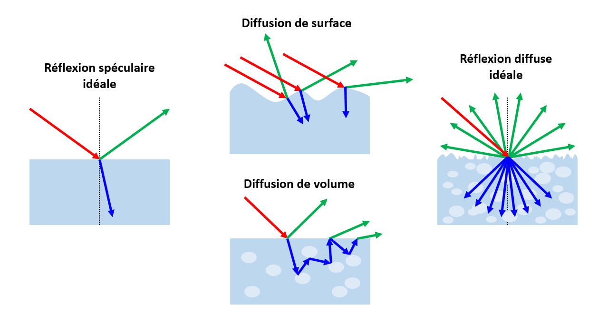

* La **réflexion spéculaire** :

Si une surface est **lisse**, et le matériau **homogène** au regard des longueurs d'ondes de la lumière incidente, la réflexion se fera dans **une direction**.
Nous sommes ici dans le cas d'une loi de **Snell-Descartes simple**, et si l'intégralité de la lumière est réfléchie nous avons un **miroir parfait**.

* La **réflexion diffuse** :

Si la surface est **rugueuse**, ou le matériau **hétérogène** au regard des longueurs d'ondes de la lumière incidente, la réflexion se fera dans de **multiples directions**.
Nous sommes ici dans face à une **multitude de réflexions** et **réfractions** sur de multiples interfaces, dans différentes directions.
Si les réflexions sont suffisamment nombreuses, la source devient **lambertienne** : pour un angle d'incidence donné sa luminance est indépendante de l'angle avec lequel on l'observe.

La lumière provenant d'une source secondaire n'est jamais parfaitement spéculaire ou parfaitement diffuse, mais elle est **plus ou moins proche d'un des 2 modèles**.

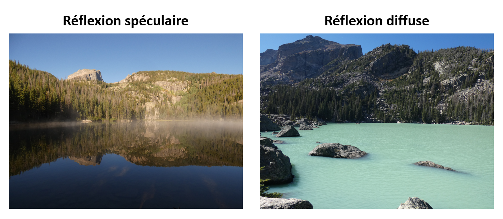

L'**angle d'incidence** avec lequel une source primaire éclaire une source secondaire aura donc une importance sur la perception que nous en avons.

Il n'existe pas de source primaire capable d'émettre avec la même énergie pour toutes les longueurs d'ondes, comment il n'existe pas de surface réfléchissant avec la même énergie pour toutes les longueurs d'onde.

* Une **source primaire** est caractérisée par son **spectre d'émission**, qui représente son irradiance en fonction de la longueur d'onde.

* Une **source secondaire** est caractérisée par son **spectre de réflexion**, qui représente sa réflectance en fonction de la longueur d'onde.

Il est clair que le **spectre de la lumière réfléchie** par une source secondaire dépendra à la fois du spectre de réfléxion de la source secondaire, **et** du spectre d'émission de la source primaire.

Voici le spectre d'émission de notre source primaire la plus commune, le **soleil** :

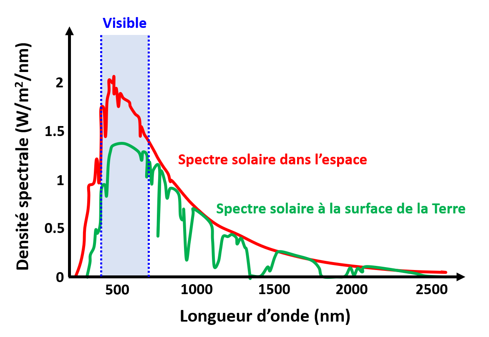

* Le spectre solaire étant proche de celui d'un **corps noir à 5777 K**, on ne s'attend pas à ce qu'un objet éclairé par celui-ci reçoive la même intensité lumineuse pour toutes les longueurs d'ondes.

* De plus, le soleil n'étant **pas parfaitement homogène**, et sa lumière étant en partie **absorbée par son atmosphère**, le spectre solaire présente des pics et des creux l'éloignant encore plus d'un spectre uniforme.

* Enfin, l'**atmosphère terrestre absorbe** aussi en partie le spectre solaire, modifiant encore le spectre qui nous éclaire à la surface de la Terre.

On remarque néanmoins que la plage de la **lumière visible** est au niveau du **pic d'irradiance**. 
On peut aussi noter que cette portion du spectre est **quasi-uniforme**. 

Ce n'est donc pas un hasard si notre vision a évolué pour être sensible à ces longueurs d'ondes !

Il faut néanmoins garder en tête que si le spectre d'émission solaire est presque uniforme à la surface de la Terre, cela reste **une approximation**.

Quand on utilise une autre source primaire pour la vision, le spectre d'émission sera différence, et donc **le spectre de la lumière réfléchie par un objet sera différent**.

Voici par exemple le spectre d'une lampe à incandescence et le spectre d'une LED blanche, comparés au spectre solaire :

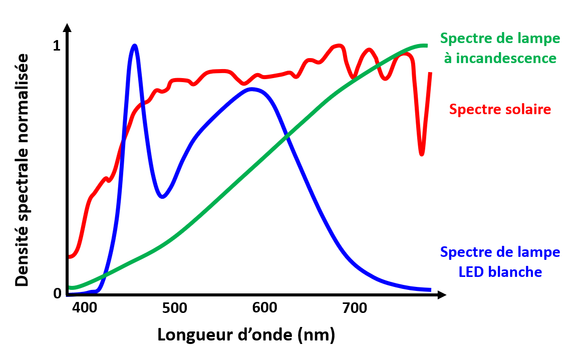

Maintenant que nous avons vu les mécanismes à l'origine de la lumière issue de notre environnement, voyons comment cette lumière est captée par notre vision.

### L'oeil, organe de la vision

Dans les systèmes de vision animale, l'**oeil** est le **capteur**.

Il s'agit d'un organe capable de **détecter la lumière** provenant d'une ou plusieurs **directions**, et de convertir cette information en **influx nerveux**.
Il est parfois capable de transmettre des **informations complémentaires** sur la lumière reçue (intensité, longueur d'onde, polarisation).

Au cours de l'évolution, différents types d'oeil sont apparus dans le monde animal, avec **différentes méthodes** et **différents niveaux de complexité** suivant les contraintes environnementales auxquels les animaux sont soumis.
Certains types d'oeil sont même apparus plusieurs fois par convergence évolutive, pour des animaux très différents mais soumis aux mêmes contraintes.

Voici un résumé très succinct des différents types d'oeil que l'on rencontre actuellement dans la nature :

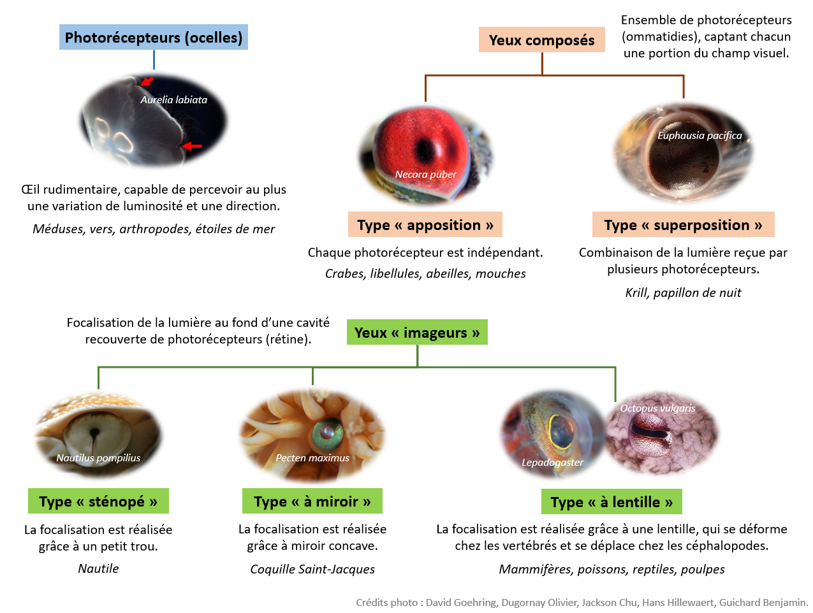

On sépare ici les yeux en 3 grandes catégories :

* Les **photorécepteurs** ou "ocelles" :

Il s'agit d'un oeil très rudimentaire, ne permettant pas de construire une "image" de l'environnement de l'animal.
Les ocelles sont au mieux capables de percevoir une variation de luminosité et une direction d'origine de la lumière.
Chez certains animaux, ils sont présents en complément d'yeux plus complexes.

* Les **yeux composés** :

Il s'agit d'un **ensemble de photorécepteurs** appellés "ommatidies", chacun capable de **percevoir une portion du champ visuel** de l'animal.
Une "image" sera composée plus tard par traitement cognitif.
On les distingue en 2 sous-catégories, suivant si les photorécepteurs sont utilisés **indépendamment** (par "apposition") ou en **combinaison** (par "superposition").
Il s'agit d'un compromis entre **résolution** et **sensibilité** : un oeil composé vera mieux dans l'obscurité par superposition, mais avec une résolution moindre que par apposition.
De manière générale, les yeux composés permettent un **grand champ de vision** et une **bonne détection des mouvements**.

* Les **yeux imageurs** :

Il s'agit d'un système optique **focalisant la lumière** au fond d'une **cavité recouverte de photorécepteurs** appellée "rétine".
Une "image" est donc physiquement formée sur la rétine, à la manière d'une **chambre noire**.
Il existe plusieurs méthodes pour focaliser la lumière : un "**sténopé**" (un trou suffisamment petit), un **miroir concave**, ou une **lentille**.
Certains animaux peuvent **modifier l'orientation** de leurs yeux avec des muscles, **ajuster la quantité de lumière** entrant dans l'oeil avec un diaphragme, et **ajuster la distance focale** de la lentille en la déplaçant ou en la déformant.
De manière générale, les yeux imageurs permettent une **fine résolution** et une **grande sensibilité à la lumière**.

De nombreux animaux possèdent **plusieurs yeux**, ce qui leur permet d'**agrandir leur champ de vision**, et d'**estimer la distance des objets** par "stéréoscopie".

**Les humains possèdent 2 yeux imageurs à lentilles**.
Il n'est donc pas étonnant que la plupart des systèmes de vision par ordinateur utilisent également ce principe.

Voici la structure de l'oeil humain schématisée :

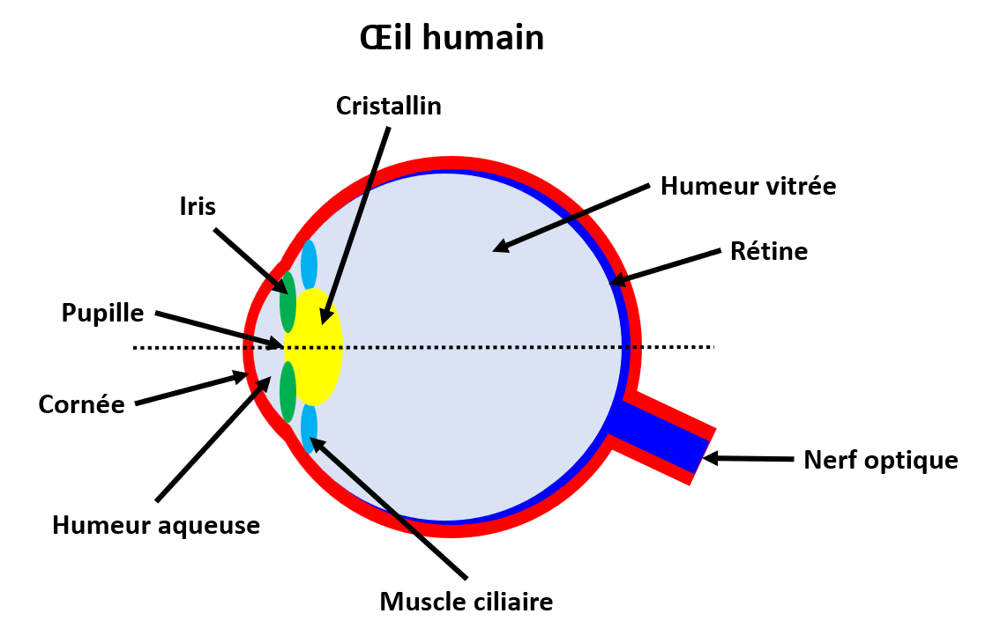

* L' "iris" est un **diaphragme** qui permet d'ajuster la quantité de lumière entrant dans l'oeil.

* Le "cristallin" est la **lentille** de l'oeil, qui lui permet de focaliser la lumière.
Les muscles ciliaires permettent l'ajustement de la distance focale de la lentille.

* La "rétine" est la couche de **photorécepteurs** tapissant le fond de l'oeil.

* Le "nerf optique" permet de transmettre l'influx nerveux au **système cognitif**, dont nous parlerons dans la suite.

Nous verrons plus en détails son fonctionnement quand nous introduirons le concept de "caméra".

Un point commun aux 3 catégories d'oeil que nous avons présentées est la présence de "**photorécépteurs**".

Les photorécepteurs sont des **cellules réagissant à la lumière** en générant un **influx nerveux**, à la manière d'un **transducteur**.
Il s'agit plus précisément de neurones spécialisés, utilisant des protéines photosensibles de la famille des "opsines" pour détecter les photons.

Chez les humains, il existe 2 grands types de photorécepteurs :

* Les **bâtonnets** (95% des photorécepteurs de la rétine) :

Ces cellules sont **très sensibles**, avec un pic d'absorption aux alentours de 498 nm.
Elles ne permettent pas de distinguer des couleurs, et sont en général saturées de jour.
Par contre, elle nous permettent de voir dans des **environnements faiblement éclairés**, et de détecter des **mouvements en périphérie** de notre vision.

* Les **cônes** (5% des photorécepteurs de la rétine) :

Chez les humains, ces cellules sont de **3 types**, "Bleu" / "Vert" / "Rouge" (ou Short / Medium / Long en anglais), avec des pics d'absorption différents aux alentours de 437 / 533 / 564 nm.
Elles nous permettent ainsi de **distinguer les couleurs**, mais elles sont beaucoup moins sensibles et permettent un champ de vision beaucoup plus réduit que les cônes.
Leur répartition sur la rétine n'est pas égalitaire, avec environ 10 / 30 / 60 %.

Voici des images de la rétine prises avec un microscope et des colorants :

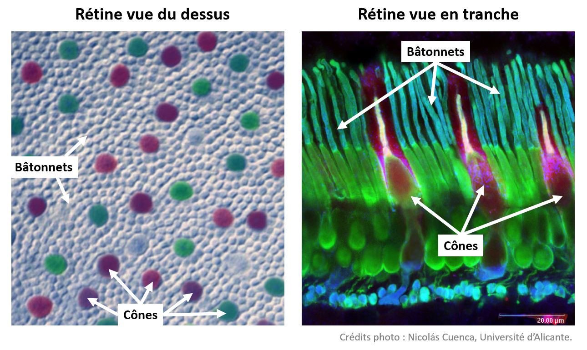

La vision humaine est donc **trichromatique**, ce qui aura des conséquences en vision par ordinateurs.
Cependant, ce n'est pas la norme dans le règne animal.
Par exemple, les cétacés sont monochromates, la plupart des mammifères terrestres sont dichromates, la plupart des réptiles et des oiseaux sont tetrachromates.

Voici le spectre d'absorption approximatif des photorécépteurs humains :

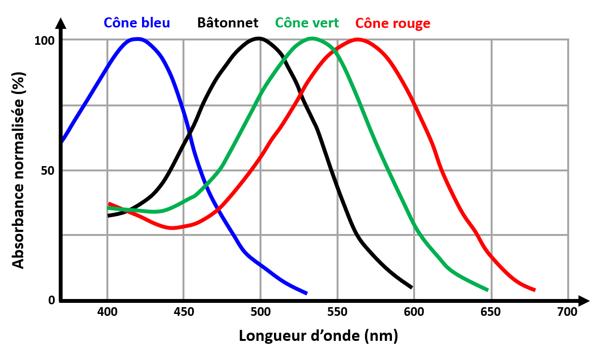

Nous reparlerons plus loin de la notion de "couleur", qui peut être ambiguë.

Il est important de noter que les bâtonnets et les cônes ne sont **pas répartis uniformément sur la rétine** : 

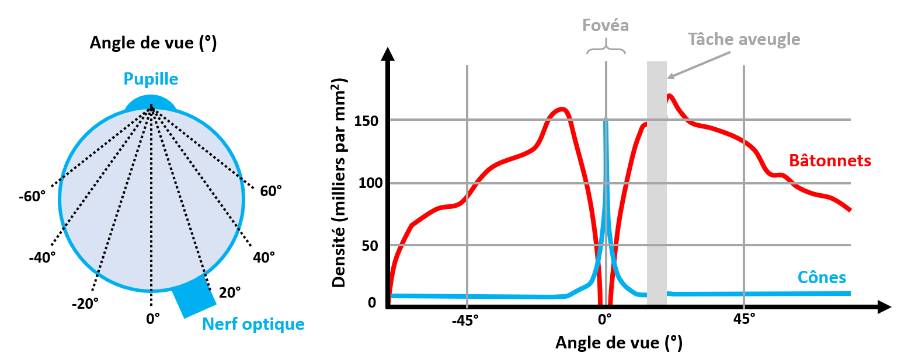

* **La densité des cônes explose** entre -10 et 10° autour du centre de la rétine, alors que **la densité des bâtonnets diminue**.
On appelle cette zone la "fovéa".

* Il y a une **tâche dépourvue de photorécepteurs** entre 15 et 20° du centre de la rétine, correspondant à l'emplacement du **nerf optique**, dont nous reparlerons plus loin.
On appelle cette zone "tâche aveugle".

* La densité des bâtonnets diminue avec l'angle par rapport au centre de la rétine, mais ils restent **beaucoup plus denses que les cônes**.

Cette répartition impacte directement le **champ de vision** humain, avec différentes types de vision suivant la direction d'où vient la lumière par rapport à l'oeil :

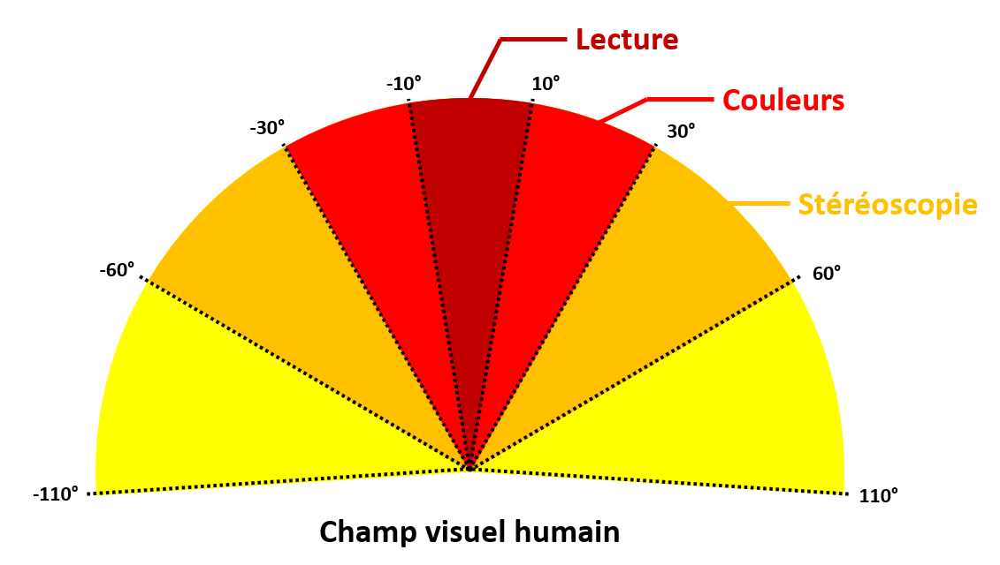

* Le champ visuel de la lecture n'est qu'entre -10 et 10°.

* Le champ visuel de la discrimination des couleurs n'est qu'entre -30 et 30°.

* Le champ visuel stéréoscopique n'est qu'entre -60 et 60°.

Alors que le champ visuel total humain peut s'étendre de -110 à 110° !

Il est important d'avoir ces éléments de fonctionnement de l'oeil en tête pour comprendre les problématiques liées à la vision humaine, et à la vision par ordinateur qu'elle a inspiré.
Mais comme nous l'avons évoqué plus tôt, la vision est plus compliquée que la simple acquisition d'une image, c'est aussi un **traitement cognitif** complexe !

### Le cerveau, grand illusioniste

Si l'oeil est le capteur de notre système visuel, **nous ne percevons jamais l'image brute formée sur notre rétine** ou **le signal brut** généré par chacun de ces photorécepteurs.
Et c'est quelque chose qu'il faut avoir en tête quand on parle de la vision humaine !

Nous "voyons" en réalité une représentation **filtrée**, **modifiée** et **interprétée** de notre environnement, et ceci sans même nous en rendre compte.

**Notre cerveau est un grand illusioniste**.

#### Le système nerveux visuel humain

Voici une représentation schématique du système nerveux visuel humain :

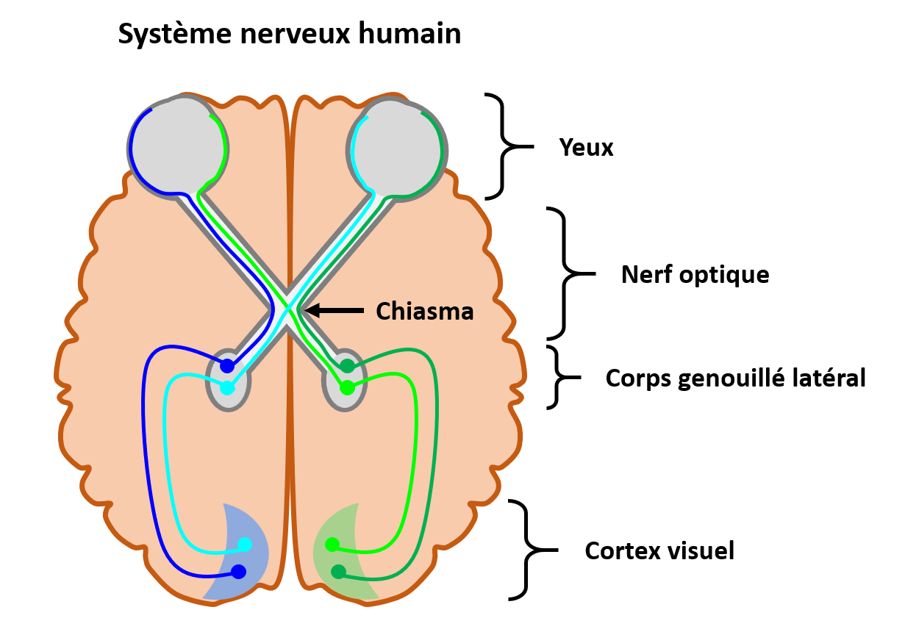

* La lumière transformée en **influx nerveux** par nos yeux.
Ce signal est transmis vers le **cerveau** par le **nerf optique** de chaque oeil.

* Les 2 nerfs se croisent au niveau du **chiasma optique**.

Là, les informations de la partie gauche de chaque retine passent à droite, et les informations de la partie droite de chaque rétine passent à gauche.
Ainsi, le champ visuel droit sera traité par l'hémisphère gauche du cerveau, et le champ visuel gauche par l'hémisphère droit, en **stéréoscopie**.

* Les informations ainsi séparées vont ensuite dans une partie du thalamus appelée **corps genouillé latéral**.

Des **traitements** et **filtres** sont appliqués aux signaux, en conservant l'information de position sur la rétine.
Les informations sont ensuite relayés au cortex visuel.

* Le **cortex visuel primaire** est la première couche de traitement cognitif complexe.

Elle va extraire des informations de **contours**, de **contrastes**, de **mouvements**, de **position** dans le champ visuel.
Ces informations vont être transmises aux autres aires du cortex visuel.

* Les autres aires du **cortex visuel** vont permettre les **interprétations** complexes nécessaire à la vision : détection d'objets, reconnaissance, couleurs, trajectoires, etc.

Il est à noter que ce trajet de l'information est plein de **rétroactions**, et que le cerveau **combine les informations** des yeux avec celles d'autres sens et de la mémoire.

**Nous allons voir quelques traitements et interprétations que fait notre cerveau pour notre vision**.

#### Faire disparaitre les informations inutiles

Parlons d'abord de **filtrage**.
Lors de sa lecture de notre environnement, le cerveau fait disparaitre différents éléments gênants sans que l'on s'en aperçoive :

* Le **nez** :

C'est le plus évident.
Votre nez représente une portion non-négligeable de votre champ de vision, et pourtant à moins de vous concentrer dessus, vous ne le voyez jamais.
Si vous fermez un oeil, il réapparait.
Le cerveau croise la perception des 2 yeux pour faire disparaitre votre nez. 

* La **tâche aveugle** :

Comme nous l'avions mentionné plus tôt, la zone de la rétine autour du nerf optique est dépourvue de photorécpteurs.
On parle alors de "tâche aveugle", car l'oeil est incapable de détecter la portion de l'image projetée sur cette partie de la rétine.
Et pourtant, même si vous fermez un oeil, vous ne voyez pas une tâche noire dans votre champ de vision.
Votre cerveau rempli le vide.

En 1668, le physicien Edme Mariotte réalise une expérience que vous pouvez facilement reproduire chez vous.
Cachez votre oeil droit avec votre main, et regardez fixement avec votre oeil gauche la croix blanche à droite sur ce dessin :

Avancez ou reculez votre visage de l'écran.
A un moment, comme par magie, le cercle blanc à gauche disparait !

Vous avez trouvé la distance pour laquelle le cercle est projeté sur la tâche aveugle de votre oeil, et votre cerveau a complété avec le bleu qui entoure le cercle.

* Les **vaisseaux sanguins** de la rétine :

La rétine est constituée de cellules vivantes, et elle a donc besoin d'être irriguée par des vaisseaux sanguins.
Nous devrions donc voir en permanence les vaisseaux sanguins passant devant les photorécepteurs.
Mais leur position étant constante, nous cerveau les supprime de notre vue sans que nous nous en apercevions.

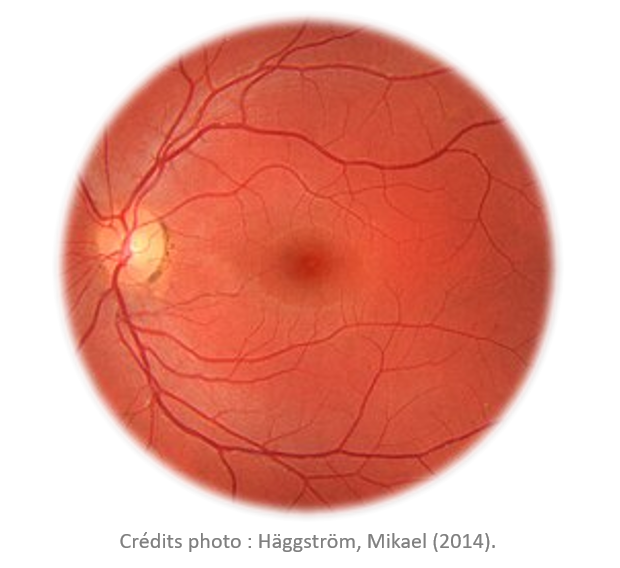

Il est néanmoins possible tromper votre cerveau pour les faire apparaitre.
Mettez-vous dans l'obscurité, allumez une lampe, et fermez un oeil.
Secouez votre lampe juste en dessous de votre oeil ouvert.
Vous devriez voir apparaitre les vaisseaux sanguins de votre rétine !

Secouer la lampe fait bouger l'ombre des vaisseaux sanguins sur votre rétine, qui rend plus difficile le traitement pour votre cerveau.

Parmi les autres **traitements** appliqués aux signaux provenant de nos yeux, on peut citer le **retournement de l'image**, qui est projetée à l'envers sur la rétine par notre cristallin.
Nous en reparlerons quand nous introduirons le concept de "caméra".

#### La couleur est une construction du cerveau.

Si le spectre réfléchi reçu par notre oeil est une grandeur physique mesurable, **ce n'est pas directement ce que nous voyons**.
Notre cerveau reçoit les stimuli provenant des 3 types de cônes, et les converti en une sensation que nous appelons "couleur".

La couleur n'est donc pas une propriété des objets de notre environnement, mais une **construction mentale** qui va dépendre du spectre réfléchi par les objets et du spectre d'absorption des cônes.

Pour preuve, on peut percevoir une même couleur pour des spectres reçus différents.
C'est ce que l'on appelle des **couleurs métamères**.

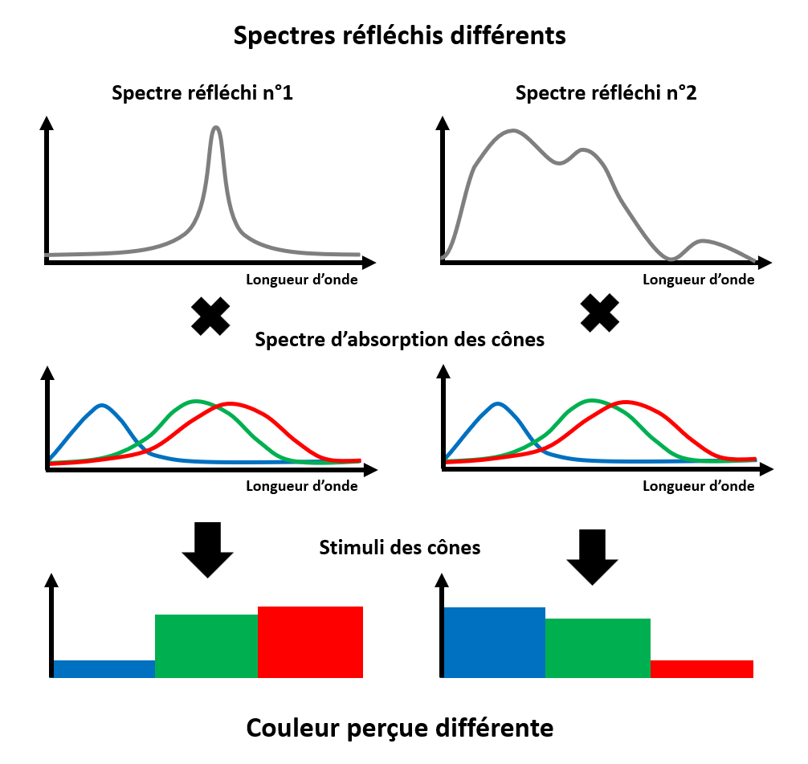

La couleur étant une construction du cerveau, celui-ci peut en **modifier notre perception selon le contexte**, afin de faciliter notre interprétation de l'environnement.
Par exemple, le cerveau adapte notre perception de la couleur en fonction de l'éclairage, afin que nous soyons capable de reconnaitre un objet peu importe son éclairage.
C'est ce que l'on appelle le principe de "constance des couleurs".

En 2015 apparait sur les réseaux sociaux le meme "The dress".
Il s'agit de l'incapacité des internautes à identifier la couleur d'une robe sur une photo : bleu et noir ou jaune et blanc ?

L'origine du débat est la difficulté à identifier l'éclairage de la robe sur la photo : est-il jaune ou bleu ?

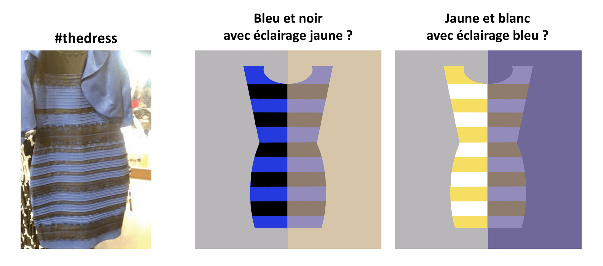

Suivant l'a priori que prend votre cerveau sur l'éclairage, il interprétera différement la couleur de la robe : votre ressenti sera différent.
Et pourtant, on peut facilement vérifier que dans les 2 cas, le spectre réfléchi est **strictement le même** !

Nous reparlerons plus loin des couleurs et introduirons le concept de "colorimétrie".

#### Découpage des contours et objets

Pour donner du sens à ce que nous voyons, notre cerveau cherche en permanence à **découper des formes** dans l'image que nous percevons.

Le but est évident : déliminer les **contours des objets** dans notre environnement, et les séparer de l'arrière-plan, pour les identifier par la suite.

Pour  voir ce travail à l'oeuvre, voici 2 illusions d'optique célèbres :

Dans la 1ère illusion, notre cerveau délimite un triangle qui n'est pourtant pas dessiné explicitement.
Dans la 2nde illusion, notre cerveau ne sait pas s'il doit séparer un vase noir d'un arrière-plan blanc, ou 2 visages blancs d'un arrière-plan noir.

Nous reparlerons plus loin des problématiques de détection de contours et de segmentation d'images.

#### Estimation de la taille et des distances

Sans que nous nous en rendions compte, notre cerveau réalise en permance des estimations de **taille** et de **distance** des objets qui nous entourent.

Pour des objets suffisamment **proches**, comme nous avons 2 yeux, le cerveau peut utiliser la **stéréoscopie**.
Nous en reparlerons plus loin.

Pour des objets **lointains**, notre cerveau doit se baser sur des **indices dans l'image**.
Par exemple :

* Les lignes droites, les ombres ou la diminution de la taille apparente d'objets connu, afin de comprendre la perspective.

* La taille apparente d'un objet inconnu par rapport à un objet connu se situant à côté.

* Le souvenir de la taille que peut raisonnablement faire un type d'objet.

Les estimations de taille et de distance d'un objet par le cerveau vont donc **dépendre du contexte** de l'environnement.

On peut facilement voir ce travail à l'oeuvre, en essayant de tromper notre cerveau sur la taille d'un trait ou d'un cercle.
Voici 2 illusions d'optique connues à ce sujet :

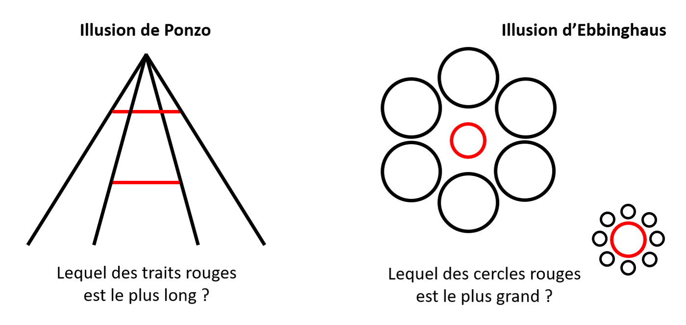

Vous avez aussi probablement eu un jour la sensation que la lune était plus grande dans le ciel, ou plus proche que d'habitude.
Il s'agit également d'une illusion : la taille apparente de la lune dans le ciel ne change pas de manière perceptible.

#### L'apparence du mouvement

Tous les objets de notre environnement ne sont pas fixes, et il est donc vital pour notre système visuel d'être capable de **percevoir le mouvement**.

Si nos yeux restent fixes et qu'un objet se déplace par rapport à nous, l'image formée sur nos rétine va changer, se qui va modifier les stimuli reçus par notre cerveau.
Reste alors à reconnaitre que la modification des stimuli correspond au déplacement d'un même objet, ce qui est loin d'être simple !
Et pourtant, notre cerveau le fait sans même que nous nous en appercevions.

Nous reparlerons plus tard de la perception du mouvement.

Néanmoins, il y a un point intéressant à aborder pour la suite : on peut tromper notre cerveau pour se donner l'illusion de mouvement.
Vous le savez déjà, c'est le principe utilisé pour le **cinéma**.

Si on fait défiler suffisamment vite devant nos yeux une succession d'images fixes représentant un même objet à différentes positions, nous aurons l'impression du mouvement.
On parle de **mouvement apparent**.

Voici un exemple simple :

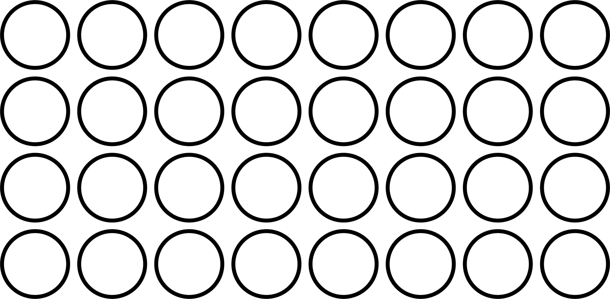

On a l'impression de voir les ronds rouge-orange-jaune se déplacer les uns après les autres, alors qu'il ne s'agit que d'une suite d'images avec des ronds blancs changeant de couleur d'une image à l'autre.
Notre cerveau crée la sensation de mouvement.

Si ce type d'illusion est particulièrement intéressante, c'est parce qu'elle va nous être utile dans la suite de ce cours, quand nous parlerons de "flux optique" et de "temps de rafraichissement d'écran".

|Nota Bene|
|:-|
|Dans la culture populaire, le phénomène du "mouvement apparent" est souvent relié à la "persistance rétinienne".|
|Si l'origine exacte du phénomène est encore sujet à débat, on sait en revanche depuis longtemps qu'il n'est pas lié à la persistance rétinienne.|
|Il est plus probablement lié à ce que l'on appelle "l'effet phi".|

#### Interprétations complexes

Nous avons vu que notre cerveau filtre les informations inutiles, interprète les couleurs, les contours, les tailles, les distances et les mouvements.
Mais il est capable d'un niveau d'interprétation supérieur.

Vous pouvez d'un seul regard :

* Mettre un nom sur un visage familier.

* Comprendre les panneaux de signalisation sur la route.

* Anticiper la trajectoire d'un ballon pour l'attraper.

* Repérer un fruit mûr sur un étalage.

* Deviner au visage de quelqu'un s'il est heureux ou triste.

Ces tâches qui vous paraissent faciles demandent en réalité un **processus cognitif très complexe !**

Lorsque l'on met en place un système de **vision par ordinateur**, on cherche à reproduire la vision humaine avec une machine.
Et nous avons vu que reproduire la vision humaine, ce n'est pas seulement reproduire le capteur, notre **oeil**, mais aussi reproduire le processus de **traitement** et d'**interprétation** du cerveau !

Nous reparlerons à la fin de ce chapitre des principales catégories de problématiques en vision par ordinateur.

### Computer vision

La "**vision par ordinateur**" ou "**computer vision**" en anglais, est la discipline de "l'**intelligence artificielle**" (ou **IA**) visant à **reproduire avec des machines la vision humaine**.

Comme vous l'aurez maintenant compris, "reproduire la vision humaine" implique :

* De reproduire l'**oeil**, organe capable de former une image à partir de la lumière réfléchie par notre environnement, et de la transformer en signal électrique.

C'est pourquoi dans ce chapitre, nous introduirons le concept de **caméra**, le concept d'**image numérique**, et les principaux paramètres à maitriser en **photographie**.

* De reproduire les **traitements** appliqués aux images en amont par le cerveau pour les rendre lisibles.

C'est pourquoi vous aurez grâce au chapitre suivant une introduction au **traitement d'images**.

* De reproduire les **interprétations complexes** réalisée par le cortex visuel.

C'est pourquoi les 2 derniers chapitres vous introduirons des outils de d'**apprentissage supervisé** ("Machine-Learning") modernes pour des problématiques de vision.

|Nota Bene|
|:-|
|Si la vision par ordinateur est grandement bio-inspirée, cela ne signifie pas que toutes les méthodes utilisées sont similaires à celles qui ont évolué chez l'humain pour répondre aux mêmes problématiques.|
|En effet, la vision par ordinateur s'attache plus à reproduire le résultat que la méthode pour y arriver.|

## La caméra : une machine à faire du 2D

### Sténopé et chambre noire

### L'objectif photographique

### La photographie argentique

### La photographie numérique

### Réglages d'une caméra

Le triangle d'exposition :

* Ouverture

* Vitesse d'obturation

* Sensibilité ISO

## Numérisation d'une image : passer du monde continu au monde discret

### Discrétisation de l'image

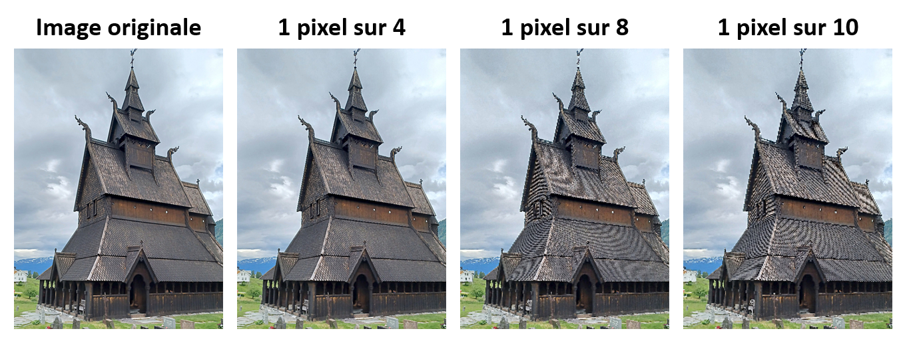

### Encodage des couleurs

### Formats et compression

## L'écran : reproduire le réel

## Manipuler des images avec Python

### Pillow

### Scikit-image

### Open-CV

## Retouche d'images : améliorer la lisibilité

### Luminosité

### Contraste

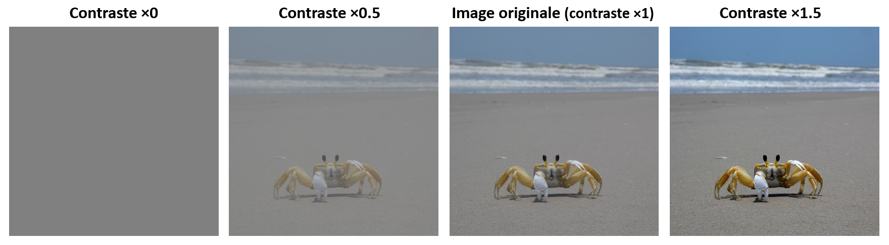

### Saturation

## Les histogrammes : étalonner des images

### Analyse des histogrammes

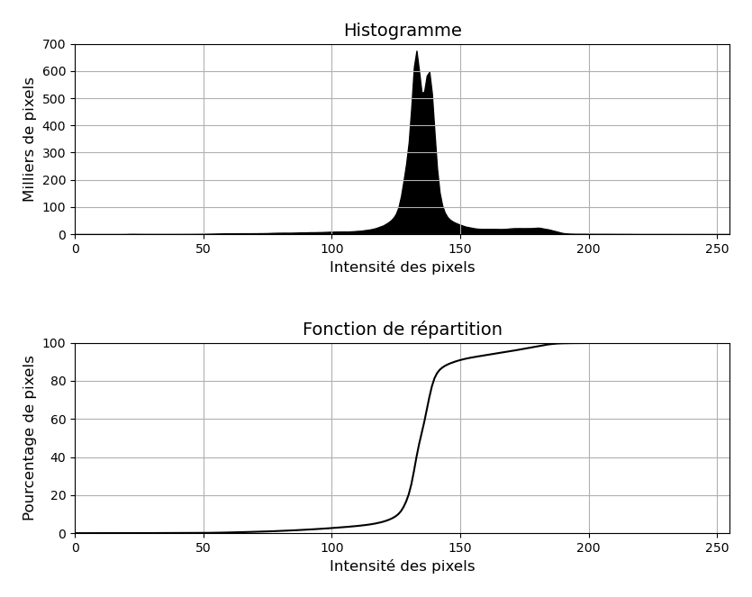

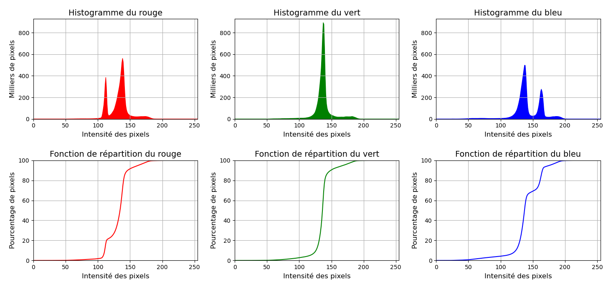

### Histogram equalization

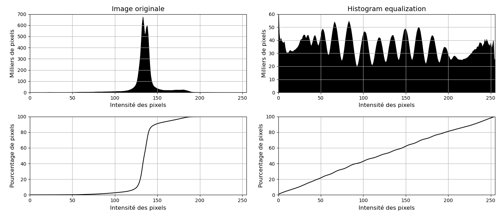

### Histogram matching

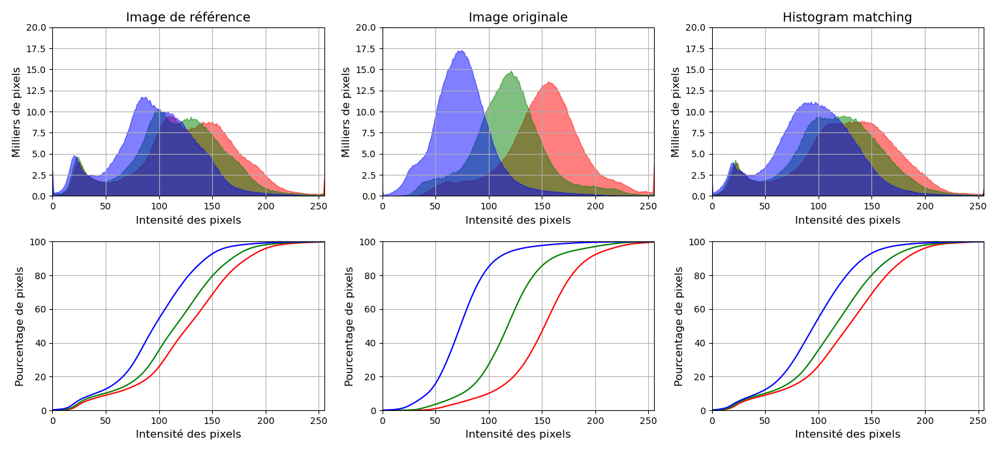

## A la recherche des dimensions perdues

### La stéréoscopie

### Le flux optique

## La vision par ordinateur

### Classification d'images

### Localisation d'objets

### Segmentation d'images

### Reconstruction 3D / suivi

## Conclusion