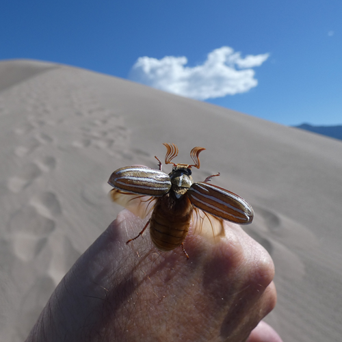

# Exercice 1 : retouche et étalonnage d'une image

## Sujet

Le but de cet exercice est de préparer une image pour une application de vision par ordinateur.
Vous la trouverez [ici](https://github.com/NicOudart/UVSQ_EN3901_computer_vision/blob/master/images/Ten_lined_june_beetle.jpg).

Il s'agit d'une image JPEG d'un _Polyphylla decemlineata_, une espèce de hanneton appelé "Ten lined June beetle" aux Etats-Unis :

Cette photographie a été prise dans le parc national "Great Sand Dunes" (Colorado, USA).
D'après ses métadonnées, elle a les propriétés suivantes :

|Propriété            |Valeur            |
|:-------------------:|:----------------:|
|Ouverture            |$f/2.8$           |
|Temps d'exposition   |$1/2500 s$        |
|ISO                  |$80$              |
|Distance focale      |$4 mm$            |
|Résolution           |$3000 \times 3000$|
|Poids                |$1.74 Mo$         |
|Format               |JPEG              |
|Profondeur de couleur|$24 bits$         |
|Encodage des couleurs|sRGB              |

## Question 1 : la mise au point

Pour prendre cette photographie, une caméra ayant un objectif classique constitué d'un lentille convergente de focale fixe, que nous considèrerons parfaite, a été utilisée.

Imaginons que le hanneton mesure 5 cm, et se trouve à 25 cm de la caméra au moment de la photographie.

* A quelle distance du capteur photographique doit-on placer la lentille de l'objectif afin de faire la mise au point ?

* Quelle sera alors la taille de l'image du hanneton sur le capteur photographique ?

## Question 2 : la profondeur de champ

* Quel est ici le diamètre d'ouverture du diaphragme ?

Considérons que le cercle de confusion du capeur photographique a un diamètre de 5 µm.

Pour le choix d'ouverture et de distance de mise au point qui ont été faits pour cette photographie :

* Quelle est la distance hyperfocale ?

* Quelle est la distance la plus proche considérée comme nette ?

* Quelle est la distance la plus lointaine considérée comme nette ?

* Déduisez-en la profondeur de champ.

## Question 3 : l'exposition

Avec le temps d'exposition et l'ouverture choisie :

* Quel est l'indice de lumination (ou EV) ?

On considère qu'une scène très ensoleillée comme celle que nous avons photographiée ici nécessite une EV pour ISO 100 (ou $EV_{100}$) de 15.

* Pour obtenir un résultat similaire à $EV_{100} = 15$ pour ISO 80, quelle EV faudrait-il choisir ? Notre choix d'exposition est-il donc adapté ? Sinon, faudrait-il augmenter ou diminuer l'exposition ?

Partons des hypothèses suivantes : le hanneton s'envole et il bouge donc rapidement, l'appareil a un temps d'exposition minimum de 1/2500 s, et le photographe veut une profondeur de champ resserrée sur le hanneton.

* Expliquez pourquoi nous ne pouvons donc pas jouer sur la valeur d'EV pour obtenir un résultat similaire à $EV_{100} = 15$ pour ISO 80 ?

On décide donc de plutôt jouer sur le paramètre ISO de l'appareil photographique :

* Quelle valeur d'ISO utiliser pour obtenir un résultat similaire à $EV_{100} = 15$, pour la même valeur d'EV ?

## Question 4 : la discrétisation

Vous l'aurez remarqué, il y a des rayures sur la carapace du hanneton.
Imaginons que sur l'image du hanneton formée sur le capteur, la distance entre 2 rayures soit de 10 µm.

* Quelle doit être la distance d'échantillonnage maximale sur le capteur afin d'éviter un phénomène d'aliasing ?

D'après les métadonnées, les couleurs de l'image sont encodées en sRGB, avec une profondeur de 24 bits.