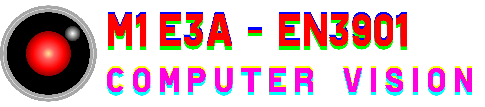

# M1 E3A - EN3901 : Traitement et analyse d'images - Computer vision

_Cours de "Computer vision" conçu pour les étudiants du M1 E3A de l'Université de Versailles Saint-Quentin (UVSQ), dans le cadre de l'UE "Traitement et analyse d'images / fondements de l'IA"_

---

---

## Credits

_Sauf mention contraire, les images utilisées dans ce cours sont des photographies de Nicolas OUDART._

© Nicolas OUDART & Assaad ZEGHINA